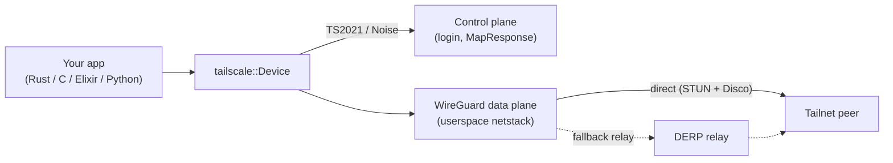

<p align="center">
  
</p>

<h1 align="center">tailscale-rs</h1>

<p align="center">
  <a href="https://github.com/GeiserX/tailscale-rs/actions/workflows/ci.yml"></a>
  <a href="LICENSE"></a>
  
  
  <a href="https://github.com/tailscale/tailscale-rs"></a>
</p>

A fork of [tailscale/tailscale-rs](https://github.com/tailscale/tailscale-rs).

`tailscale-rs` is a work-in-progress Tailscale library written in Rust, with language bindings to
C, Elixir, and Python.

> [!CAUTION]
> This software is unstable and insecure.
>
> I welcome enthusiasm and interest, but please **do not** build production software using these
> libraries or rely on it for data privacy until I've had a chance to batten down some hatches
> and complete a third-party audit.
>
> See [Caveats](#caveats) for more details.

## Getting Started

The following instructions are for Rust! For other languages, see the language-specific README:
- [C](ts_ffi/README.md)
- [Elixir](ts_elixir/README.md)
- [Python](ts_python/README.md) 

Add this dependency line to your `Cargo.toml`:

```toml
[dependencies]
# Published as `tailscale-rs`; imported as `tailscale`.
tailscale = { package = "tailscale-rs", version = "0.6" }
```

> **Not yet published to crates.io;** for now depend on it via git:
>
> ```toml
> [dependencies]
> tailscale = { package = "tailscale-rs", git = "https://github.com/GeiserX/tailscale-rs" }
> ```

Either way, you import it as `tailscale` (e.g. `use tailscale::Device;`) — the crate name on
crates.io is `tailscale-rs`, but the library name is `tailscale`.

Examples of using the `tailscale` crate can be found in [`examples/`](examples/README.md).

For instructions on how to run tests, lints, etc., see [CONTRIBUTING.md](CONTRIBUTING.md). For the high-level architecture and
repository layout, see [ARCHITECTURE.md](ARCHITECTURE.md).

### Code sample

A simple UDP client that periodically sends messages to a tailnet peer at `100.64.0.1:5678`:

```rust
use std::{
    time::Duration,
    net::Ipv4Addr,
    error::Error,
};
use tailscale::{Config, Device};

#[tokio::main]
async fn main() -> Result<(), Box<dyn Error>> {
    // Open a new connection to tailscale
    let dev = Device::new(
        &Config::default_with_key_file("tsrs_keys.json").await?,
        Some("YOUR_AUTH_KEY_HERE".to_owned()),
    ).await?;

    // Bind a UDP socket on this node's tailnet IP, port 1234
    let sock = dev.udp_bind((dev.ipv4().await?, 1234).into()).await?;

    // Send a packet containing "ping" to 100.64.0.1:5678 once per second
    loop {
        sock.send_to((Ipv4Addr::new(100, 64, 0, 1), 5678).into(), b"ping").await?;
        tokio::time::sleep(Duration::from_secs(1)).await;
    }
}
```

## How it works

A `Device` joins the tailnet by authenticating to the **control plane** over Tailscale's
TS2021 (Noise) channel, then moves data over an in-process **WireGuard** data plane — connecting
peer-to-peer where NAT traversal allows, and relaying through **DERP** otherwise.



For the full module layout and design notes, see [ARCHITECTURE.md](ARCHITECTURE.md).

## Caveats

This software is still a work-in-progress! I'm providing it in the open at this stage out of a
belief in open-source and to see where the community runs with it, but please be aware of a few
important considerations:

- This implementation contains unaudited cryptography and hasn't undergone a comprehensive security
  analysis. Conservatively, assume there could be a critical security hole meaning anything you send
  or receive could be in the clear on the public Internet.
- There are no compatibility guarantees at the moment. This is early-days software &mdash; I may
  break dependent code in order to get things right.
- Direct peer-to-peer connections via NAT traversal are implemented (STUN-discovered endpoints and
  Disco, with `CallMeMaybe` hole-punching over DERP), and traffic falls back to DERP relays when no
  direct path is available. Symmetric-NAT birthday-paradox hole-punching is not yet implemented,
  so behind some NATs a flow stays relayed through DERP, which caps its throughput.
- The `TS_RS_EXPERIMENT` environment variable is required to be set to `this_is_unstable_software`
  for all code linked against `tailscale-rs`; this includes Rust, C, Elixir, and Python code. I'll
  remove this requirement after a third-party code/cryptography audit and any necessary fixes.

For the full security posture — unaudited cryptography, the Tailnet Lock enforcement gap, peerAPI
capability limitations, at-rest key handling, and how to report a vulnerability — see
[SECURITY.md](SECURITY.md).

## Versioning, Releases, and Compatability

I follow semver and aim to make a point release roughly monthly. Since this is pre-1.0, there are no
backwards-compatability guarantees. I'm aiming for a stable 1.0 release as soon as I can, but there's
currently no timeline.

## MSRV and Edition

The current MSRV is 1.94.1. The current edition is Rust 2024.

`tailscale-rs` has a rolling MSRV (Minimum Supported Rust Version) policy to support the current
and previous Rust compiler versions, and the latest
[edition of Rust](https://doc.rust-lang.org/edition-guide/editions/index.html).

I may lag the latest version/edition in rare cases to let dependencies catch up and to
perform any necessary fixes.

## Platform Support

The following platforms and architectures are supported:

- Linux (`x86_64`/`ARM64`)
- macOS (`ARM64`)
- Windows (`x86_64`)

## Status

`tailscale-rs` is a work-in-progress - I'm still rapidly iterating, fixing bugs, and adding new
features. I aim to keep this section up-to-date, but the [issue tracker](https://github.com/GeiserX/tailscale-rs/issues)
is the best way to see the latest updates.

### Implemented

These are features that are currently implemented:

- Basics
  - Create TCP and UDP sockets on the tailnet
  - Direct connections via NAT traversal (STUN-discovered endpoints and Disco, with `CallMeMaybe`
    hole-punching over DERP); traffic falls back to public DERP relays only when no direct path is
    available
  - Peer lookups (addressing peers by MagicDNS name, in-process)
  - MagicDNS (an in-netstack resolver on `100.100.100.100:53` answering A/AAAA/PTR for tailnet
    peers and control-pushed static records (`ExtraRecords`); by default fail-closed — with no
    `fallback_resolvers` configured, non-tailnet names get NXDOMAIN and are never forwarded
    upstream. Configuring `fallback_resolvers` opts in to forwarding non-tailnet query names to
    those upstream resolvers.)
  - Split DNS (per-domain `routes` from control: a query matching a route's suffix is forwarded to
    that route's resolvers by longest-suffix match; a route with an empty resolver list is a
    negative route answering NXDOMAIN. Recursive forwarding to `fallback_resolvers`/`resolvers`
    applies only when no route matches.)
  - Using a subnet router (accepting peer-advertised subnet routes via `accept_routes`; opt-in,
    fail-closed off by default)
  - Using an exit node (routing internet-bound traffic through a chosen peer via `exit_node`,
    selectable by Tailscale stable ID, tailnet IP, or MagicDNS name; opt-in, fail-closed off by
    default). The exit node can also be changed at runtime with `Device::set_exit_node` — the
    equivalent of Go `tsnet`'s `LocalClient.EditPrefs(ExitNodeID/ExitNodeIP)` — without recreating
    the device.
  - Recursive MagicDNS forwarding in TUN mode (the `100.100.100.100:53` resolver now forwards
    non-tailnet names recursively in TUN mode, matching the netstack-mode behavior; the same
    fail-closed default applies — without `fallback_resolvers`, non-tailnet names get NXDOMAIN)
  - Tailscale Serve: `Proxy`, `Text`, `TcpForward`, plus HTTP `Path` (path-prefix mux) and
    `Redirect` (HTTP 3xx) handlers; all TLS-terminating targets are validated and dispatched
    fail-closed (unmatched path → 404, backend dial failure → drop)
  - Tailnet Lock (TKA), **partial**: per-peer node-key signature verification is wired and
    unit-tested at the peer-trust chokepoint and fails closed when a trusted-key `Authority` is
    supplied. Live enforcement is **currently inert** — the AUM-chain sync RPC that would supply the
    `Authority` is not yet implemented, so a compromised control plane can still inject peer keys.
    See [SECURITY.md](SECURITY.md) before relying on it.
  - Communicate with the Tailscale Go client, `tsnet`, and `libtailscale`
- Language support
  - Rust API
  - C, Elixir, and Python bindings

### Coming Soon

These are features or efforts I have in the pipeline and am actively working towards, but with
no guarantees on timeline or completion:

- Third-party code and cryptography audit

### Unsupported

This is an incomplete list of features in the Tailscale Go client, `tsnet`, and/or `libtailscale`
that are *not* currently supported. I'd like to add all of these eventually! If there's something
on this list you'd like to see supported, or something _not_ on this list you're not sure about,
please open an issue!

<details>
<summary>
Unsupported features
</summary>

- Networking
  - Peer relays
  - Exit Nodes (being one — advertising a default route; *using* one is supported)
  - Exit node DNS (`ExitNodeDNSResolvers` — routing DNS through the exit node)
  - Private DERP relays
  - Subnet Routers (being one — advertising routes; *using* one is supported)
- Platforms
  - AIX
  - Android
  - BSDs
  - iOS
  - Plan9
  - QNAP
  - Synology DSM
- Observability
  - Client Metrics
  - Endpoint Collection
  - Device Posture Collection
  - Log Streaming
  - Network Flow Logs
- Other Features
  - Application Capabilities
  - Automatic Key Rotation
  - HTTPS Certificates
  - Kubernetes
  - Mullvad VPN
  - Node Sharing
  - Taildrive
  - Taildrop
  - Tailnet Lock — full enforcement (signature verification is wired, but the AUM-sync RPC that
    supplies the trusted-key `Authority` is not yet built, so enforcement is inert; see
    [SECURITY.md](SECURITY.md))
  - Tailscale Funnel
  - Tailscale Serve — the stored serve-config runtime and accept-loop (the `Path`/`Redirect`/`Proxy`/
    `Text`/`TcpForward` handlers themselves are implemented)
  - Tailscale SSH
  - Tailscale Services
  - Webhooks
- Any other features not listed in "Implemented" or "Coming Soon"

</details>

## Legal

WireGuard is a registered trademark of Jason A. Donenfeld.
