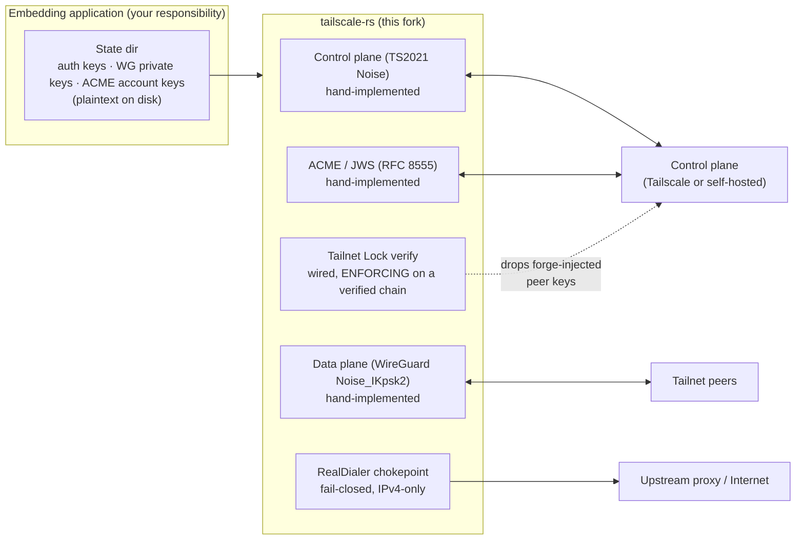

# Security Policy

This is a pure-Rust, work-in-progress reimplementation of the Tailscale `tsnet` node. It is shared
in the open out of a belief in open source, but it is **experimental software**. This document is an
honest account of its current security posture so that anyone considering routing real traffic
through it can make an informed decision.

> [!CAUTION]
> All code linked against this library must set `TS_RS_EXPERIMENT=this_is_unstable_software` before
> the process starts. That gate exists *because* of the limitations below — most importantly the
> unaudited cryptography. **Do not remove the gate to make a build look production-ready.** It is
> meant to stay until an independent audit lands and any resulting fixes ship.

## Trust boundary

The control plane is trusted today for the lock *toggle*: it can enable or disable Tailnet Lock. Once
a verified lock has been synced, the client rejects peer node-keys that lack a signature from a key in
the cryptographically verified chain — so a malicious or compromised control plane **cannot** forge a
trusted key to admit an unauthorized peer. It can still *disable* the lock (downgrade to admit-all),
and disablement-secret verification is not yet implemented (see below).

## Unaudited cryptography

This fork hand-implements its cryptographic protocols and **has not undergone an independent
cryptographic or security audit**. The hand-rolled surfaces include:

- **WireGuard data-plane handshake** — `Noise_IKpsk2` (`ts_tunnel/src/handshake.rs`).
- **Control-plane handshake** — the TS2021 control Noise.
- **ACME / JWS** — RFC 8555 certificate issuance and JWS signing (`ts_control/src/acme.rs`).
- **Exit dialer** — a hand-rolled SOCKS5 (RFC 1928/1929) and HTTP `CONNECT` client (zero extra
  dependencies, to keep the egress path `ring`-only and musl-clean).
- **Tailnet Lock (TKA) CBOR** — the CTAP2-canonical CBOR encoding in `ts_tka` is **not**
  cross-validated against Go-produced test vectors. Byte-for-byte wire compatibility with a live
  Tailscale TKA is asserted by construction, not proven (see the `ts_tka` crate module docs). A
  *failed* verification is always safe to act on (deny); a *successful* verification should be
  treated as advisory until vectors land.

Conservatively, assume there could be a critical flaw in any of these paths. Do not rely on this
library for data privacy until the audit is complete.

## Tailnet Lock (TKA) status

Per-peer key-signature verification is **wired, unit-tested, and actively enforcing** at the
peer-trust chokepoint (`ts_runtime`'s `peer_tracker`), matching Go's `tkaFilterNetmapLocked`. Once a
verified lock `Authority` has been synced from control, the chokepoint fails **closed**: a peer
presenting a missing or unauthorized `key_signature` is **dropped** at the peer-db upsert path —
neither is admitted into the peer database. With no lock synced, every peer is admitted (identical to
Go's `b.tka == nil` early return / pre-TKA behavior); when the lock is disabled, enforcement clears
and all peers are admitted again.

The authority only ever reaches the enforcement path **after** `VerifiedAumChain::verify` — a
cryptographically verified AUM chain. Enforcement never engages on an unverified chain; the verified
authority is delivered from the control runner to the peer tracker over an internal watch channel.
**Self is structurally never filtered** — the self node never enters the peer database, so a node
cannot lock itself out of its own netmap via this path.

**Threat model.** Control is trusted for the enable/disable *toggle* only. A malicious or compromised
control plane can **disable** the lock (downgrade to admit-all), but it **cannot** forge a trusted
key to admit a specific unauthorized peer: admission still requires a signature from a key in the
cryptographically verified chain. Two caveats remain, tracked as deferred work in
[`docs/PARITY_ROADMAP.md`](docs/PARITY_ROADMAP.md):

- **Disablement-secret verification is deferred.** The cryptographic proof that a given disable is
  authorized is not yet checked, so a disable is currently taken at face value.
- **Known under-enforcement gaps versus Go** — both make us *more permissive* or are
  connectivity-only; neither opens a new attack surface, but document them honestly:
  - **No rotation-obsolete dropping.** Go's `rotationTracker` drops a peer whose key was rotated away
    even if the old signature still validates (clone/replay defense); we currently admit such a key.
    This is genuine *under*-enforcement (more permissive than Go) and is not structurally closeable
    yet — it needs a `node_key_authorized_with_details` path plus a whole-netmap rotation pass.
  - **No `UnsignedPeerAPIOnly` exemption.** Go admits such peers unsigned; we drop them (*more*
    restrictive — a connectivity gap, the safe direction), which would only surface if the node model
    ever ingests that field.

## peerAPI capability gap

Taildrop and ingress authorization are currently **membership-only**: any node in the tailnet is
permitted, rather than being scoped to a per-peer capability as upstream does (e.g. the
`FILE_SHARING_SEND` / ingress capabilities). This is a known gap — peer capabilities are not yet
enforced for these surfaces.

## At-rest key handling is the embedder's responsibility

Auth keys, WireGuard private keys, and ACME account keys are persisted by `ts_keys` **without
at-rest encryption or in-memory zeroization**. The library does not protect this material on disk.
Securing the state directory (filesystem permissions, full-disk or directory encryption, restricting
access to the running user) is the **embedding application's** responsibility.

## Anti-leak posture (the strong part)

The design invariant this fork is built around — **the origin IP never leaks, egress is
fail-closed, and egress is IPv4-only** — is enforced both structurally and in CI:

- The `RealDialer` trait in `ts_forwarder` is the single anti-leak chokepoint. The default
  `DirectDialer` structurally refuses exit egress, so the real origin IP cannot leak by accident; the
  proxy dialer is selected only when exit egress is explicitly enabled and a proxy is configured.
- Any proxy connect/handshake failure **drops the flow** — there is never a fallback to a direct
  host-IP dial. UDP over the proxy fails closed. An SSRF guard rejects forbidden exit destinations
  (loopback / link-local / unspecified), and proxy credentials are redacted from `Debug` output.
- The `checks` crate runs in CI and statically guards these invariants: `ipv4_only_forwarder`,
  `ipv4_only_host_net`, `funnel_fail_closed`, `ssh_isolation`, and lint enablement. DNS forwarding is
  routed through filters that drop any non-IPv4 upstream, so a v6 upstream can never be constructed
  on the egress path.

## Reporting a Vulnerability

If you believe you have found a security vulnerability, please report it privately rather than
opening a public issue:

- Open a **private GitHub Security Advisory** at
  <https://github.com/GeiserX/tailscale-rs/security/advisories/new>
  (or via the repository's `Security` tab → `Report a vulnerability`).

Please include a description of the issue, the affected component(s), and steps to reproduce if
possible. We will acknowledge the report and work with you on a coordinated disclosure timeline.

## Not affiliated with Tailscale Inc.

This is an independent fork. "Tailscale" is a trademark of Tailscale Inc. This project is not
endorsed by, sponsored by, or affiliated with Tailscale Inc. WireGuard is a registered trademark of
Jason A. Donenfeld.
