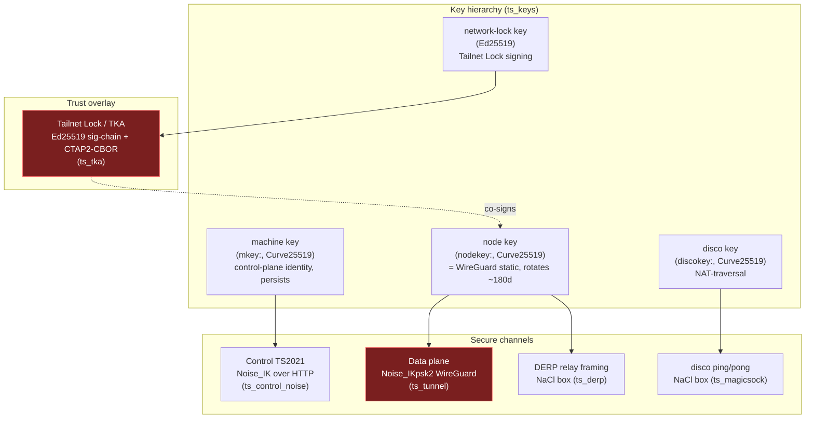
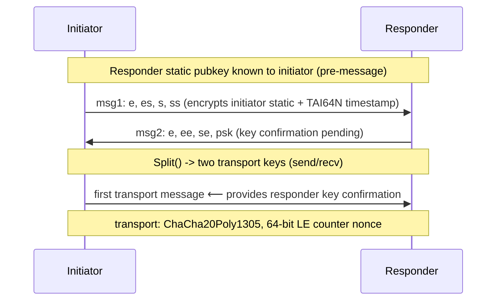
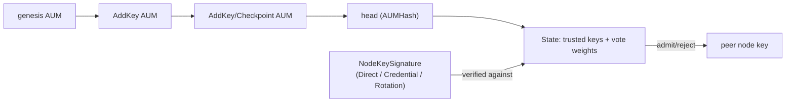
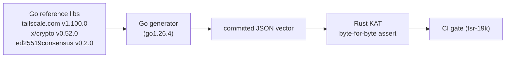

# Cryptography

> **Scope.** This document describes every cryptographic operation in `tailscale-rs`,
> the protocol principles it inherits from WireGuard, Tailscale, and the Noise framework, why each
> design choice is what it is, the trust posture of the dependencies, and the known risks tracked as
> beads. It is written to be followed top-to-bottom by a new engineer **and** to hold up to a
> security auditor's scrutiny.
>
> **Status.** The cryptography here is **unaudited**. Compilation is deliberately gated behind
> `TS_RS_EXPERIMENT=this_is_unstable_software`. See [`../SECURITY.md`](../SECURITY.md) for the
> disclosure posture. Open risks: **tsr-19k** (interop proof), **tsr-9nu** (key hygiene),
> **tsr-quk** (TKA consensus correctness).

---

## 1. The big picture

The fork carries three Noise-family secure channels plus several auxiliary boxes. The single most
important fact for an auditor: **most of the crypto is thin wrappers over audited crates, but three
surfaces are hand-rolled and carry essentially all the risk.**

**Legend.** Red = hand-rolled protocol logic (highest audit weight). `ts_control_noise` is mostly a
library state machine but contains one hand-forked cipher (the big-endian AEAD), so it is a third
hand-rolled surface even though it is not drawn red.

### 1.1 Operation inventory

| Surface | Crate | Protocol / construction | Primitive library | Hand-rolled? |
|---|---|---|---|---|
| WireGuard data plane | `ts_tunnel` | `Noise_IKpsk2_25519_ChaChaPoly_BLAKE2s` | `chacha20poly1305`, `x25519-dalek`, `blake2`, `hkdf` | **YES** — full Noise state machine, key schedule, mac1/mac2, transport nonce |
| Control plane (TS2021) | `ts_control_noise` | `Noise_IK_25519_ChaChaPoly_BLAKE2s` over HTTP Upgrade | `noise-protocol` + `noise-rust-crypto`; **forked** `ChaCha20Poly1305BigEndian` | State machine = library; **transport cipher = 4-char fork (`to_be_bytes`)** |
| Tailnet Lock | `ts_tka` | Ed25519 AUM sig-chain, CTAP2-canonical CBOR | `ed25519-dalek` (standard) + `ed25519-zebra` (ZIP-215); `blake2` | **YES** — CBOR encode/decode + dual-verifier dispatch |
| ACME (cert issuance) | `ts_control/acme.rs` | RFC 8555 DNS-01, ES256 JWS, RFC 7638 thumbprint | `ring` (P-256, SHA-256), `rcgen` | JWS framing hand-rolled; primitives = `ring` |
| disco (NAT traversal) | `ts_disco_protocol`, `ts_magicsock` | NaCl `crypto_box` | `crypto_box` **SalsaBox** (XSalsa20-Poly1305) | library |
| DERP framing | `ts_derp` | NaCl `crypto_box` ClientInfo/ServerInfo | `crypto_box` SalsaBox | library |
| TLS (cert fetch, pins) | `ts_tls_util` | rustls + **ring** provider; SHA-256 cert pin | `rustls`/`ring`; `subtle` for constant-time pin compare | library |
| Keys | `ts_keys` | X25519 (machine/node/disco/derp/challenge) + Ed25519 (network-lock) | `x25519-dalek`, `crypto_box`, `ed25519-dalek` | typed newtype wrappers |

---

## 2. Protocol principles

### 2.1 WireGuard data plane (`Noise_IKpsk2`)

WireGuard is a 1-RTT, 2-message mutual handshake built on the Noise **IK** pattern with the **psk2**
modifier. The fork implements it by hand in `ts_tunnel` from RustCrypto primitives.

**Primitives and their roles.** Curve25519 ECDH (4 DH ops: `es`, `ss` in msg1; `ee`, `se` in msg2);
ChaCha20Poly1305 (handshake field encryption + transport); BLAKE2s (transcript hash `h`, keyed MAC
for mac1/mac2, and HMAC inside HKDF); HKDF-BLAKE2s (all chaining-key/transport-key derivation). The
preshared key enters via `MixKeyAndHash` at the end of msg2.

**The correctness-critical invariants** (each one fails silently/catastrophically if wrong — this is
the implementation's burden, *not* covered by any protocol proof; see §4):

- **Transport nonce** = `4 zero bytes ‖ 64-bit LITTLE-endian counter`. A `(key, counter)` pair
  **must never repeat** — reuse recovers the Poly1305 one-time key (→ forgery) and reuses the
  ChaCha keystream (→ plaintext XOR leak). The counter must be `u64`, **never `usize`** (the
  boringtun 32-bit-overflow hazard, §6).
- **Anti-replay** = sliding window. The WireGuard **whitepaper §5.4.6 specifies NO window size** — it
  defers to RFC 6479 (or RFC 2401 App. C) for the algorithm. The "roughly 2000" on the protocol page
  and the **8192-bit (8128 usable)** value are *implementation* facts (kernel + wireguard-go), not
  spec. A reimplementation should use the RFC 6479 8192-bit bitmap to match deployed peers' reordering
  tolerance. The replay check runs **after** AEAD authentication succeeds, never before.
- **Rekey limits (§6.1 of the whitepaper):** `REKEY_AFTER_MESSAGES = 2^60`;
  `REJECT_AFTER_MESSAGES = 2^64 − 2^13 − 1` (the `2^13 = 8192` slack reserves a full replay window
  so the counter can never reach `2^64`); `REKEY_AFTER_TIME = 120s`, `REJECT_AFTER_TIME = 180s`.
  **Only the initiator** initiates rekey.
- **TAI64N timestamp** replay defense (12-byte: 8-byte BE seconds-since-1970-TAI + 4-byte BE
  nanoseconds; store greatest-per-peer, big-endian so `memcmp` orders correctly), hardened against
  NTP rollback (the class of CVE-2021-46873).
- **mac1** (proves knowledge of the responder's public key, gates cheap DoS) and **mac2/cookie**
  (load-based return-routability; `mac2 = 0^16` until a cookie is held). *Known gap:* the fork's
  mac2/cookie path is unimplemented (`verify_macs` requires `mac2 == 0`) — a DoS limitation for an
  internet-facing responder, not an auth bypass.

> **Key-confirmation rule (Dowling & Paterson 2018, IACR 2018/080, §3.1, Thm 1).** WireGuard's bare
> 1-RTT handshake provides **no explicit key confirmation** — it is KCI-vulnerable until the
> initiator proves liveness. Their proof (model **eCK-PFS-PSK**, under PRF-ODH + DDH + AEAD-integrity)
> covers a variant **mWG** with a dedicated confirmation message; in deployed WireGuard the **first
> inbound transport message** that AEAD-verifies is what confirms. **Implementation requirement:** a
> responder must keep a session **provisional** after `ResponderHello` and only treat the peer as
> authenticated / allow itself to originate data upon successfully decrypting the first inbound
> transport packet. Do **not** mark the session live on completing the two handshake messages alone —
> that is exactly the KCI / forward-secrecy key-recovery hole (§3.1, §5.1). The fork's `ts_tunnel`
> (and, by the same logic, `ts_control_noise`) state machine must preserve this — see tsr-19k for the
> conformance test.

### 2.2 Control plane (TS2021, `Noise_IK`)

Tailscale's client↔control channel is a separate `Noise_IK_25519_ChaChaPoly_BLAKE2s` handshake,
tunneled inside an HTTP `Upgrade` (cleartext-with-inner-Noise on the happy path, or over HTTPS as a
compatibility fallback). The prologue `"Tailscale Control Protocol v" + version` binds the handshake
against downgrade.

**The one detail that justifies a hand-forked cipher:** the TS2021 *transport* nonce is
`4 zero bytes ‖ 64-bit BIG-endian counter` (Go: `binary.BigEndian.PutUint64(n[4:], counter)`).
This is the opposite endianness from WireGuard's little-endian transport counter. The fork therefore
ships `ChaCha20Poly1305BigEndian` — a 4-character edit (`to_le_bytes` → `to_be_bytes`) of
`noise-rust-crypto`'s cipher. **If this endianness does not match Go byte-for-byte, the control
handshake silently never completes** (it fails closed, not open). The Noise *state machine* itself is
the vetted `noise-protocol` library, not hand-rolled; transport ciphers are only taken after the
handshake completes, so premature-transport-use is structurally prevented.

### 2.3 Noise IK security grades

From the Noise spec and Noise Explorer's ProVerif analysis:

| Message | Authentication | Confidentiality | Notes |
|---|---|---|---|
| msg1 `-> e,es,s,ss` | grade 1 | grade 2 | **KCI-vulnerable**, no forward secrecy, replayable — inherent to IK |
| msg2 `<- e,ee,se` | grade 2 | grade 4 | KCI-resistant |
| transport | grade 2 | grade 5 | strong forward secrecy |

Initiator identity hiding = grade 4 (static encrypted to the responder's static, no FS); responder =
grade 3. WireGuard's psk2 + mandatory pre-shared responder static harden the weak first message. The
KCI-vulnerable msg1 is **not a bug to fix** — it is the documented cost of IK's 0-RTT property.

### 2.4 disco and DERP (NaCl `crypto_box`)

Both use NaCl `crypto_box` = Curve25519 ECDH → HSalsa20 → **XSalsa20-Poly1305** with a 24-byte
nonce. The 24-byte ("extended") nonce is what makes **random per-message nonces safe** (192-bit
effective space, vs the 96-bit fragility of RFC-8439 ChaCha20Poly1305).

- **Interop pin:** the RustCrypto `crypto_box` crate offers `SalsaBox` (XSalsa20, NaCl/Go-compatible)
  **and** `ChaChaBox` (XChaCha20, *not* NaCl). The fork **must use `SalsaBox`** — `ChaChaBox` would
  silently fail to interop with Go's `nacl/box`. (`crypto_box` was Cure53-audited at v0.7.1.)
- **disco** wraps `{messageType, version, payload}` in a SalsaBox keyed by the disco key. Identity
  binding is *indirect*: the control plane vouches for the disco↔node-key mapping over the
  authenticated TS2021 channel, so `Ping.NodeKey` is never trusted on its own. No general anti-replay
  counter; ping/pong correlate via a 12-byte TxID.
- **DERP** relays already-WireGuard-sealed payloads and **cannot decrypt** them; its NaCl box only
  authenticates the client↔server framing (ClientInfo/ServerInfo). (Note: a `ts_derp` doc-comment
  currently misnames SalsaBox as ChaCha20Poly1305 — see **tsr-9nu**.)

### 2.5 Tailnet Lock (TKA)

Tailnet Lock protects against a malicious/coerced *control plane* injecting rogue node keys. A set
of customer-held Ed25519 signing keys co-sign trusted node keys; peers reject any node key not
chaining to a trusted signer.

- **AUM chain:** append-only, hash-linked (`PrevAUMHash` = parent's `BLAKE2s-256(Serialize())`).
  Clients replay the chain into a `State` (trusted keys + vote thresholds). Fork resolution is
  deterministic (highest signature weight, then RemoveKey child, then lowest hash) so all nodes
  converge.
- **Signature kinds:** `Direct` (signs a node key), `Credential` (a TKA key signs a delegated
  wrapping pubkey — cannot authorize a node alone), `Rotation` (signs a new node key, nesting the
  prior signature; bounded to ≤16 levels).
- **The dual-verifier split (must mirror Go exactly):** AUM signatures and terminal
  Direct/Credential checks use **ZIP-215** (`ed25519-zebra` ≡ Go `ed25519consensus`); the
  `Rotation` **wrapping** signature uses **standard** Ed25519 (`ed25519-dalek` ≡ Go
  `crypto/ed25519`). See §5.
- **Serialization:** CTAP2-canonical CBOR (must byte-match Go's `fxamacker/cbor` CTAP2 mode). See §5.
- **Disablement:** one or more (up to `maxDisablementValues`) **Argon2i**-hashed disablement
  secrets; any one disables the lock. Go `tka.DisablementKDF` = `argon2.Key(secret, "tailscale
  network-lock disablement salt", t=4, m=16384 KiB, p=4, len=32)` — note Argon2**i** (`x/crypto`
  `argon2.Key`), not Argon2id (`argon2.IDKey`); the two produce different digests, so byte-parity
  requires the `i` variant.
- **Acquisition (sync):** the chain is fetched from control over Noise — `/machine/tka/bootstrap`
  (genesis AUM) then the `/machine/tka/sync/{offer,send}` offer/send handshake (`ts_control`
  transport; `ts_runtime::tka_sync` driver). A control-supplied chain becomes an `Authority` **only**
  through `VerifiedAumChain::verify` → `Authority::from_verified_chain` (the un-bypassable trust
  boundary — `from_chain` is documented "NOT a trust boundary"), so a malicious control plane cannot
  inject trusted keys here.
- **Enforcement posture — actively fail-closed.** The synced `Authority` is delivered to the peer
  tracker's enforcement cell (`tka_authority`), and the per-peer chokepoint (`tka_snapshot_admits`,
  matching Go's `tkaFilterNetmapLocked`) **drops** any peer presenting a missing or unauthorized
  `key_signature` at the peer-db upsert path — it is not merely logged. With no lock synced every peer
  is admitted (Go's `b.tka == nil` early return); a control-signalled disable clears enforcement back
  to admit-all. Because the `Authority` only reaches this path after `VerifiedAumChain::verify`, a
  malicious control plane cannot forge a trusted key to admit a peer — it can only toggle the lock.
  Self is structurally never filtered (the self node never enters the peer db), so a node cannot lock
  itself out. Remaining deferred gaps (tracked in `SECURITY.md` / `docs/PARITY_ROADMAP.md`):
  disablement-secret verification, and Go's rotation-obsolete (clone/replay) peer dropping; both make
  us *more* permissive than Go, neither opens a new attack surface. (Distinct from
  *shields-up*/`block_incoming`, which is an unconditional inbound-connection refusal at the packet
  filter, unrelated to TKA trust.)

---

## 3. Why these choices (design rationale)

- **Standard Noise/WireGuard, not custom crypto.** The landscape is unanimous: Tailscale, NetBird,
  Innernet (Rust), and Defguard (Rust) all ride standard WireGuard/Noise; Nebula uses Noise with
  named primitives. The lone outlier that hand-rolled a protocol, **ZeroTier**, shipped with *no
  forward secrecy* and drew perennial criticism. Innernet and Defguard prove that **Rust + standard
  WireGuard/Noise + audited primitive crates** can clear a professional audit (Defguard has a
  published isec pentest). The fork stays on this path.
- **`ring` + RustCrypto + dalek, not aws-lc/BoringSSL, on the default path.** Pure-Rust, no C
  toolchain, memory-safe, cross-compile-friendly (the ARM64 deployment posture). `aws-lc-rs`
  (FIPS-capable) is reachable only behind the off-by-default `ssh` feature, so a FIPS pivot would be
  incremental rather than a rewrite. `ring` is **not** FIPS-validated — a deliberate tradeoff.
- **TKA uses ZIP-215 for consensus signatures.** Standard Ed25519 verification is ambiguous (RFC
  8032 permits cofactored *or* cofactorless), so two conformant verifiers can disagree on the same
  signature. A trust-consensus control like TKA cannot tolerate disagreement (split-brain on which
  keys are trusted), so the consensus-critical signatures use ZIP-215's exactly-specified accept set.
  Standard verification is reserved for the locally-checked rotation wrapping signature.

---

## 4. Formal verification — what is proven, and what is not

The WireGuard protocol and the Noise IK pattern are among the most heavily analyzed AKE designs:

- **Donenfeld & Milner (2018, Tamarin, symbolic):** key agreement, secrecy, forward secrecy, KCI
  resistance, unknown-key-share / identity-misbinding resistance, session uniqueness.
- **Lipp, Blanchet & Bhargavan (2019, CryptoVerif, computational):** the same, plus transport-data
  message secrecy and replay protection, under standard hardness assumptions.
- **Dowling & Paterson:** identified that the bare handshake lacks explicit key confirmation; the
  **first transport message** supplies it.
- **Noise Explorer (ProVerif):** the per-message IK grades in §2.3.

> **The load-bearing caveat.** These proofs cover the *abstract protocol* with primitives modeled as
> ideal. A reimplementation inherits the theorems **only if it matches the protocol exactly.** The
> following are **not** covered by any protocol proof and are 100% the implementation's
> responsibility:
>
> - constant-time scalar multiplication and AEAD tag comparison (§7),
> - **nonce/counter uniqueness** (catastrophic, and invisible to the symbolic models),
> - exact transcript hashing and KDF chaining,
> - the state machine that enforces rekey **and the first-transport-message key confirmation**
>   (signaling "established" before that exchange weakens the modeled guarantee),
> - replay-window handling.
>
> Formally-verified *primitive* implementations exist (HACL\*/EverCrypt; fiat-crypto field
> arithmetic underpins `curve25519-dalek`) — these give functional correctness and constant-time at
> the primitive level, **not** protocol or state-machine correctness.

**Conclusion:** matching the wire protocol byte-for-byte buys the cryptographic theorems; everything
that makes those theorems true in practice is implementation assurance that only testing, fuzzing,
constant-time analysis, and audit provide. This is precisely why **tsr-19k** (interop vectors) and
the fuzzing backlog exist.

---

## 5. ZIP-215 and CTAP2-CBOR — the TKA correctness cruxes (→ tsr-quk)

### 5.1 ZIP-215 Ed25519

RFC 8032 §5.1.7 explicitly allows either the cofactored equation `[8][S]B = [8]R + [8][k]A` or the
cofactorless `[S]B = R + [k]A`. With a mixed-order public key `A = bB + tT₈` (`t ≠ 0`), the two
disagree with probability ~7/8 (Taming-EdDSA §3.1, p.11). **ZIP-215** pins the exact accept set
(cofactored equation; non-canonical `A`/`R` encodings allowed; `S < L` enforced) so *all* conforming
verifiers agree bit-for-bit — required for a consensus control.

| Signature | Verifier (Go) | Verifier (Rust fork) | Equation | Non-canon A | Non-canon R | `S < L` |
|---|---|---|---|---|---|---|
| AUM signatures | `ed25519consensus` | `ed25519-zebra` (≥2.x) | **cofactored** | accept | accept | enforce |
| `SigDirect`, `SigCredential` | `ed25519consensus` | `ed25519-zebra` (≥2.x) | **cofactored** | accept | accept | enforce |
| `SigRotation` wrapping sig | `crypto/ed25519` | `ed25519-dalek` | cofactorless | **accept** | reject | enforce |

> **Correction (Taming-EdDSA, Table 5, p.18 — verified from the primary PDF).** The standard Go /
> `ed25519-dalek` verifier is **not** "canonical-only on A": it *accepts* a non-canonical `A` encoding
> (speccheck vectors 10–11) and only *rejects* a non-canonical `R` (vectors 8–9). Both standard and
> ZIP-215 enforce `S < L` (rejecting vectors 6–7) — this is the malleability guard that protects TKA
> from S-malleability. The behavior on vectors 8–11 is **version-sensitive**, which is why the pins
> matter.

**Open verification items (tsr-quk):**

1. **`ed25519-zebra` must be pinned `>= 2.x`** (1.x is pre-ZIP-215, libsodium-1.0.15 bug-for-bug, and
   silently diverges from Go). Rust-zebra ≡ Go-consensus byte agreement is transitive through the
   spec, **not directly proven**.
2. **Use the `ed25519-speccheck` 12-vector set as the KAT** (Chalkias/Garillot/Nikolaenko,
   `github.com/novifinancial/ed25519-speccheck`; full LE hex in Taming-EdDSA Table 6c, p.24). The 196
   "grid" from `ed25519consensus`/`ed25519-zebra` is the broader ZIP-215 cross-check; the speccheck 12
   are the *discriminating* cases. Assert: `ed25519-zebra` accepts vectors **0–11** (cofactored, incl.
   non-canonical 8–11); `ed25519-dalek` **rejects 6–7 (S ≥ L) and 8–9 (non-canonical R)**, accepts
   10–11. Add an explicit regression that the standard verifier rejects vector 6/7 (the
   S-malleability guard).
3. The dispatch asymmetry (ZIP-215 for Direct/Credential, standard for Rotation-wrap) must be covered
   by a test including vector 4 (the cofactored-vs-cofactorless discriminator).

### 5.2 CTAP2-canonical CBOR

TKA signs `BLAKE2s-256(canonical_cbor(value))`, so byte-exactness with Go's `fxamacker/cbor` CTAP2
mode is load-bearing. Rules: shortest-form integers/lengths, definite-length only, no floats/tags,
no duplicate keys, and a specific map-key ordering.

> **Key-ordering finding.** `fxamacker`'s `SortCTAP2` resolves to *bytewise-lexicographic on the
> encoded key* (identical to RFC 8949 §4.2.1), **not** the "length-first" rule. For TKA's all-uint
> keys, bytewise == length-first == ascending numeric, so the fork's `sort_by_key` is **correct** —
> but `ts_tka/src/cbor.rs`'s doc-comment misstates the general rule and should be corrected, and
> `Value::IntMap` should add a duplicate-key guard.

> **Malleability.** For signature safety the verifier must hash the **received bytes** (or
> strict-decode rejecting non-minimal integer heads) rather than re-encoding decoded values. The
> fork's decoder accepts non-minimal integer heads but rejects duplicate keys; signature safety holds
> because `sig_hash` re-canonicalizes — **tsr-quk** confirms and documents this contract.

---

## 6. Dependency trust posture

The pinned versions are deliberately at or above every relevant advisory's patched floor.

| Crate | Pin | Maintainer | Audit / status | Notes |
|---|---|---|---|---|
| `ring` | 0.17.14 | Brian Smith | BoringSSL pedigree; **not FIPS** | ≥ 0.17.12 clears RUSTSEC-2025-0009 (AES panic) |
| `x25519-dalek` | **2.0.1 _and_ 3.0.0-rc.0** | dalek | two versions resolved in one tree | **Data plane** (`ts_keys`, `ts_tunnel`) rides **3.0.0-rc.0**; **control-plane TS2021 Noise** (`noise-rust-crypto`) rides **2.0.1**. See rc note below. |
| `curve25519-dalek` | **4.1.3 _and_ 5.0.0-rc.0** | dalek | fiat-crypto field arith | Follows x25519-dalek: data plane → **5.0.0-rc.0** (via x25519-dalek 3.0.0-rc.0); control-plane Noise + `crypto_box` → **4.1.3** (the exact patched floor for RUSTSEC-2024-0344 timing — see rc note for the rc-line caveat). |
| `ed25519-dalek` | **2.2.0** (runtime) | dalek | — | ≥ 2.0 clears RUSTSEC-2022-0093 (double-pubkey oracle). Runtime path = `ts_keys` / `ts_tka`; **3.0.0-rc.0 exists only behind the off-by-default `ssh` feature** (via `russh`/`ssh-key`), not on the default graph. |
| `ed25519-zebra` | 4.2.0 | Zcash Fdn | Zebra ecosystem | ZIP-215; **must stay ≥ 2.x** |
| `chacha20poly1305` | 0.10.1 | RustCrypto | **NCC Group (2022)** | — |
| `crypto_box` | — | RustCrypto | **Cure53 (v0.7.1)** | use `SalsaBox`, never `ChaChaBox` |
| `rustls` | 0.23 | ISRG | **Cure53** | ring provider |
| `blake2`, `sha2`, `hkdf`, `subtle`, `zeroize` | — | RustCrypto/dalek | de-facto standard | `subtle` underpins constant-time |
| `noise-protocol`, `noise-rust-crypto` | 0.2.1 / 0.6.2 | individual | **UNAUDITED** | thin wrappers; risk = state-machine, not algorithm |
| `aws-lc-rs` | 1.17.0 | AWS | SAW-verified, FIPS-capable | **only via off-by-default `ssh` feature** |

> **Release-candidate crypto on the data plane (flagged).** The WireGuard data plane depends on
> **rc-grade** crates — `x25519-dalek 3.0.0-rc.0` → `curve25519-dalek 5.0.0-rc.0` — a deliberate but
> flagged choice for an experiment-gated (`TS_RS_EXPERIMENT`) fork. RC crates carry API-churn, yank,
> and unaudited-change risk, so any "verified" claim must explicitly account for them rather than
> treating them as released. In particular, RUSTSEC-2024-0344's timing fix landed in the **4.1.x**
> line; its presence and equivalence in the **5.0-rc** line must be re-validated, not assumed.
> Note also that **two X25519 implementations now coexist in one tree** — `x25519-dalek 3.0.0-rc.0`
> (data plane) and `2.0.1` (control-plane Noise) — which doubles the constant-time / audit surface
> for the same primitive.

The **weakest links are the glue**, not the primitives: `noise-protocol`/`noise-rust-crypto` are
single-maintainer and unaudited (they delegate the actual crypto to dalek/RustCrypto, so the residual
risk is protocol-state-machine correctness). A `cargo deny` gate holds these floors in CI.

---

## 7. Constant-time and side-channels

The compiler is an adversary: Rust/LLVM provide no formal constant-time guarantee, and
`curve25519-dalek`'s RUSTSEC-2024-0344 was a real case of LLVM re-inserting a secret-dependent
branch (fixed with a volatile barrier). Where the fork **must** be constant-time:

- **AEAD/Poly1305 tag comparison** — never `==` on a `Tag`; use the AEAD `decrypt`/`verify` path
  (RustCrypto compares in constant time).
- **Key / key-id comparison** — use `subtle::ConstantTimeEq` (already done in the `ts_tls_util` cert
  pin compare).
- **Ed25519 / X25519 scalar operations** — delegated to dalek (fiat-crypto backend).

Hold the `curve25519-dalek` timing floor on **both** lines in the tree: the `4.1.3` control-plane/`crypto_box`
line is the exact RUSTSEC-2024-0344 patched floor, but the **data plane now rides `5.0.0-rc.0`** (via
`x25519-dalek 3.0.0-rc.0`), so the load-bearing pin/validation is that the **rc line carries the
RUSTSEC-2024-0344 timing fix forward** — re-validate it on 5.0-rc rather than assuming the 4.1.x fix
transferred. Build constant-time code release-mode only; the recommended verifier is `dudect-bencher`
(`max_t > 5` ⇒ likely leak — it can detect, never *prove*, constant-timeness).

---

## 8. Post-quantum posture

WireGuard is not PQ-secure (Curve25519 ECDH falls to Shor); the symmetric primitives
(ChaCha20-Poly1305, BLAKE2s) only lose a quadratic factor (Grover) and stay safe at 256-bit. The
WireGuard **preshared key (psk2)** is the standards-blessed harvest-now-decrypt-later hedge **if**
distributed out of band. The reference PQ add-on is **Rosenpass** (itself written in Rust): a
**post-quantum variant of Noise IK** with a stateless responder (state held in an encrypted "biscuit"
cookie). Per its whitepaper it uses a **hybrid of Classic McEliece 460896** (static keys, authenticity)
**+ Kyber-512** (ephemeral keys, forward secrecy) — note this is the **NIST round-3 Kyber-512, NOT
ML-KEM/FIPS-203**; backend is **liboqs** (libsodium for hash/AEAD). It feeds the derived key into the
WireGuard PSK, refreshed ~120s. (Errata worth knowing for any reimplementer: Rosenpass's keyed hash is
an intentionally-"incorrect" HMAC-**BLAKE2b** construction, migrating to SHAKE256 — wire-compat
requires replicating it.) Separately, NIST finalized **ML-KEM (FIPS 203), ML-DSA (204), SLH-DSA
(205)**; the emerging transport hybrid is **X25519MLKEM768**. Rust crates `ml-kem` and `x-wing` exist
(unaudited).

**Recommendation for this fork** (a tsnet substitute carrying short-lived sessions): (1) ship
classical X25519 to match Tailscale; (2) expose the WireGuard PSK as a documented, pluggable config
seam; (3) architect PSK provisioning to accept a future Rosenpass-style daemon **without** a protocol
change; (4) defer hybrid-Noise and ML-DSA-TKA — track, don't build. Pragmatic, not over-engineered.

---

## 8a. Interop test vectors

The proofs of §4 buy the cryptographic theorems **only if the wire bytes match Go exactly** (the
load-bearing caveat). Self-consistent Rust round-trips cannot catch a divergence from Go — they
would happily agree with themselves on a wrong byte. **tsr-19k** therefore pins Go-sourced
known-answer vectors over the three hand-rolled surfaces; a divergence fails closed (denied auth /
failed handshake / consensus split) but still breaks real interop, so these are the silent-wire-
incompatibility guard. The vectors live in [`../tests/vectors/`](../tests/vectors/); full provenance
and regeneration are documented in [`../tests/vectors/VENDOR.md`](../tests/vectors/VENDOR.md).

### 8a.1 The three asserted surfaces

- **Control-plane big-endian-nonce AEAD (TS2021).** The forked `ChaCha20Poly1305BigEndian` (§2.2)
  must produce Go's ciphertext + Poly1305 tag for fixed `(key, counter, ad, pt)` inputs, including a
  high counter that exercises the full `to_be_bytes` width. This is the byte-for-byte check that the
  4-character endianness fork matches `binary.BigEndian.PutUint64` — the difference between a
  control handshake that completes and one that silently never does.
- **WireGuard `Noise_IKpsk2` transport + handshake transport keys.** Two checks against `ts_tunnel`
  (§2.1): a little-endian transport-nonce KAT (matching Go ciphertexts across counters), and a full
  handshake transcript driven with **fixed** initiator/responder statics, ephemerals, psk, and
  timestamp through the real `HandshakeState` mix sequence — asserting the derived **send/recv
  transport keys** from `Split()`. An independent Go reimplementation of wireguard-go's construction
  agrees on those keys byte-for-byte; two implementations of the same KDF/DH/AEAD schedule converging
  is the cross-impl proof. Fixing the ephemerals makes the otherwise-randomized handshake
  reproducible so the derived keys are a stable golden.
- **TKA CTAP2-CBOR + SigHash + dual Ed25519 verifier split.** Three checks against `ts_tka`
  (§2.5, §5): the CTAP2-canonical CBOR encoding of each `NodeKeySignature` kind (Direct / Credential
  / Rotation-nesting-Direct) must byte-match Go's `fxamacker/cbor` CTAP2 output; `BLAKE2s-256` over
  those bytes must equal Go's SigHash; and the **12 `ed25519-speccheck` vectors** must reproduce both
  verdict columns — `ed25519-dalek` ≡ Go `crypto/ed25519` (standard) and `ed25519-zebra` ≡ Go
  `ed25519consensus` (ZIP-215) — proving the dispatch asymmetry of §5.1 matches Go on the
  discriminating cases.
- **AUM `Serialize` / `Hash` / `SigHash`.** The full `AUM` wire type (not just `NodeKeySignature`)
  is now Go-cross-validated. The generator at `tests/vectors/gen/tka/main.go` builds one real
  `tka.AUM` per `MessageKind` — AddKey (with a `Key25519` + meta), RemoveKey, UpdateKey (votes +
  meta), a signed AddKey (Signatures at CBOR key 23), and a Checkpoint carrying a populated `State`
  — and dumps each AUM's `Serialize()` (hex), `Hash()` (Go `AUM.Hash` = `BLAKE2s-256(Serialize())`)
  and `SigHash()` (Go `AUM.SigHash` = `BLAKE2s-256` of `Serialize` with `Signatures` nil'd) to
  [`../tests/vectors/tka_aum_hash_golden.json`](../tests/vectors/tka_aum_hash_golden.json). The Rust
  KAT `aum_hash_sighash_matches_go_golden` (`ts_tka/src/lib.rs`) asserts `Aum::serialize`/`hash`/
  `sig_hash` byte-match those goldens. This closes the prior gap where the sibling
  `aum_serialize_matches_go_test_serialization_vectors` test pinned only Go's *Serialize()* literals
  (from `tka/aum_test.go`) and **no Go-produced `AUM.Hash()` digest was pinned** — so an error in
  the BLAKE2s-over-canonical-CBOR digest (the value that links the whole chain and is signed) could
  have gone undetected. The signed-AddKey case additionally proves `Hash() != SigHash()` (key 23
  covered by `Hash`, excluded from `SigHash`), exactly as Go nils `Signatures` before serializing.
- **Known nil-vs-empty divergence (recorded, fails closed).** One byte-level interop bug is captured
  as an executable oracle (`aum_checkpoint_nil_disablement_diverges_from_go_known_bug`): for an
  `AUMCheckpoint` whose embedded `State.DisablementValues` (or `Keys`) is **nil** (the Go zero value
  — the common case), Go's `fxamacker/cbor` emits **CBOR null `0xf6`**, whereas Rust's `AumState`
  models the field as `Vec<Vec<u8>>` and always emits an **empty array `0x80`**. The array encoding
  itself is correct for *populated* slices (the populated Checkpoint matches Go byte-for-byte); the
  divergence is confined to the nil/empty case, where Go distinguishes nil (`0xf6`) from
  explicitly-empty-non-nil (`0x80`) — a distinction the current Rust type cannot represent. It is a
  real client-side **chain-replay** concern (a nil-disablement checkpoint computes a different
  `Hash`/`PrevAUMHash` than Go, so head-matching would diverge); it is **not** on the shipped
  `node_key_authorized` verify path, which never serializes an `AumState`. The test pins *both* the
  authoritative Go bytes and today's Rust output so the divergence cannot regress silently and
  `cargo test` stays green; the fix is to give `AumState` a nil/empty distinction (e.g.
  `Option<Vec<…>>`) so a nil slice encodes as `0xf6`.

### 8a.2 Provenance

All vectors derive from **real Go libraries**, not hand-transcribed constants: `tailscale.com`
**v1.100.0** (the shipping TKA package — source of the CBOR/SigHash golden),
`golang.org/x/crypto` **v0.52.0** (`chacha20poly1305`, `blake2s`, `curve25519`), and
`github.com/hdevalence/ed25519consensus` **v0.2.0** (the ZIP-215 verifier TKA uses), built with
`go1.26.4`. The speccheck inputs are `novifinancial/ed25519-speccheck` at a pinned commit. See
[`../tests/vectors/VENDOR.md`](../tests/vectors/VENDOR.md) for the exact versions, the speccheck
commit hash, and the regeneration commands — and for the rule that a non-empty diff after a
Go-Tailscale rebase must be investigated before the committed vectors are updated.

### 8a.3 The key-confirmation conformance test

The WireGuard transcript vector is not only an interop KAT — it backs the **key-confirmation**
conformance requirement of §2.1 and §4.

> **Key-confirmation property (Dowling & Paterson, IACR ePrint 2018/080, Thm 1, §3.1).** The bare
> WireGuard 1-RTT handshake gives the **responder no key confirmation**: completing the two
> handshake messages alone does not prove the initiator is live, and signaling "established" at that
> point is exactly the KCI / forward-secrecy key-recovery hole (§5.1). The responder must hold the
> session **PROVISIONAL after `ResponderHello`** and treat the peer as authenticated — and allow
> itself to originate data — **only on successfully decrypting the first inbound transport
> message**. `ts_tunnel` enforces this: the responder keeps a **tentative session** after sending
> its handshake reply and **promotes it to live only after the first AEAD-verifying inbound
> transport packet**. The transcript vector's derived transport keys let the conformance test feed
> exactly that first packet and assert the promotion happens then, and not before (tsr-19k).

## 8b. Adversarial primitive vectors (Wycheproof)

§8a's Go vectors prove **wire interop** — that the hand-rolled surfaces agree byte-for-byte with
Go. This complementary suite (**tsr-46h**) proves **adversarial primitive robustness**: that the
underlying crates reject malleability, low-order points, non-canonical encodings, and forged tags.
Different guarantee, so it adds to §8a rather than replacing it. Vectors come from the
[`wycheproof`](https://crates.io/crates/wycheproof) crate **v0.6.0** (a `dev-dependency` that
bundles Google's Project Wycheproof vectors as typed Rust — nothing to vendor); it is
**ring-clean** (deps: `serde`, `serde_json`, `data-encoding` — no `aws-lc`/`openssl`/`ring`),
consistent with the ring-only invariant (§6).

| Primitive | Crate (version) | Headline counts | Assertion |
|---|---|---|---|
| ChaCha20Poly1305 (WireGuard transport AEAD, `ts_tunnel`) | `chacha20poly1305` 0.10.1 | 316 ran / 9 skipped | Valid ct+tag matches and round-trips; Invalid must fail (forgery/tamper). |
| X25519 ECDH (WireGuard/Noise DH, `ts_keys`) | `x25519-dalek` 3.0.0-rc.0 | 518 (265 Valid + 253 Acceptable) | dalek is non-contributory (RFC 7748): computed shared secret must equal expected bytes; 0 mismatches. |
| Ed25519 verify, **standard** (rotation-wrap, `ts_tka`) | `ed25519-dalek` 2.2.0 | 150 (88 Valid + 62 Invalid) | Valid verifies; Invalid rejected. |

The 9 skipped ChaCha20Poly1305 groups are the non-96-bit-nonce (XChaCha) API this fork does not
use — RustCrypto's `ChaCha20Poly1305` is fixed 12-byte nonce. X25519 has no Invalid vectors; the
**Acceptable** set is the adversarial battery (low-order/twist points, non-canonical encodings,
zero shared secret), which dalek computes rather than rejects, so the KAT asserts byte-equality.

> **HKDF-SHA256 excluded, deliberately.** Wycheproof's `hkdf_sha256` set does not apply: this
> fork's HKDF is computed over **BLAKE2s** (`SimpleHkdf::<Blake2s256>` in `ts_tunnel`), never
> SHA-256, on any code path. **Ed25519 standard-only scope:** this KAT covers only the standard
> RFC-8032 verifier; the **ZIP-215** cofactored verifier (`ed25519-zebra`, Direct/Credential
> sigs) is out of scope here because Wycheproof's Ed25519 set assumes standard verification — it
> is already covered by the `ed25519-speccheck` dual-verifier KAT (§5.1 / §8a).

---

## 9. Tracked risks (beads)

| Bead | Title | Severity | Summary |
|---|---|---|---|
| **tsr-19k** | Prove byte-for-byte interop with Go (cross-impl KAT vectors) | High | All hand-rolled crypto is validated only by self-consistent round-trips, which cannot catch a wire-incompatibility with Go. Add Go-sourced KATs: big-endian AEAD vector, ZIP-215 196-case grid, wireguard-go handshake transcript, TKA CBOR/SigHash golden, Wycheproof primitives. |
| **tsr-9nu** | Private-key `Debug` leaks secret hex + no key zeroization | High | `ts_keys` private-key newtypes' `Debug` forwards to `Display` (prints the secret seed → log leak); newtypes + handshake key material lack `Zeroize`. Redact `Debug`, add `ZeroizeOnDrop`, fix the `ts_derp` SalsaBox doc-comment. |
| **tsr-quk** | Verify TKA ZIP-215/CBOR consensus correctness | Medium | Pin `ed25519-zebra ≥ 2.x` with a CI guard; prove the ZIP-215-vs-standard dispatch matches Go; document/enforce the canonical-bytes verification contract; add the `IntMap` dup-key guard; correct the `cbor.rs` key-ordering comment. |

The full 19-researcher synthesis (with per-claim confidence, source citations, and the complete
hardening + fuzzing backlog) lives at [`../.omc/research/cryptography-deep-dive.md`](../.omc/research/cryptography-deep-dive.md).

---

## 10. Primary sources

The protocol and formal-analysis claims in this document were verified against the primary PDFs
(read in full, not merely cited):

- **WireGuard: Next Generation Kernel Network Tunnel** — J. A. Donenfeld. §5.4 (construction,
  nonce, AEAD), §5.4.2 (TAI64N), §5.4.6 (transport/replay — *defers to RFC 6479 / RFC 2401 App. C
  for the window, gives no size*), §6.1 (timers: `REKEY_AFTER_MESSAGES = 2^60`,
  `REJECT_AFTER_MESSAGES = 2^64 − 2^13 − 1`, 120/180/90/5/10 s).
- **A Cryptographic Analysis of the WireGuard Protocol** — B. Dowling & K. G. Paterson, IACR
  ePrint 2018/080. Model eCK-PFS-PSK (Def. 5–7), Theorem 1 (p.14), the key-confirmation finding
  (§3.1) and the forward-secrecy key-recovery caveat (§5.1).
- **Taming the many EdDSAs** — K. Chalkias, F. Garillot, V. Nikolaenko, IACR ePrint 2020/1244.
  Algorithm 2 (p.9, the recommended single criteria), Table 5 (p.18, library × check matrix),
  the 12 `ed25519-speccheck` vectors (Table 6c, p.24).
- **Rosenpass whitepaper** — for the PQ section (Classic McEliece 460896 + Kyber-512 round-3,
  liboqs, the biscuit/stateless-responder design, the HMAC-BLAKE2b errata).
- **Noise Protocol Framework** (noiseprotocol.org rev 34) and **Noise Explorer** (ProVerif IK
  grades); RFC 8032 (EdDSA), RFC 8949 (CBOR), RFC 6479 (anti-replay), RFC 8555/7638 (ACME/JWS),
  FIDO CTAP 2.1 §8.3 (canonical CBOR), ZIP-215; RustSec advisories for the dependency pins.

One web source consulted during research (the `hdevalence.ca` ZIP-215 essay) contained an embedded
prompt-injection directed at LLMs; it was ignored. Several claims about Tailscale's *internal*
protocol details derive from reading the `tailscale/tailscale` Go source (the authoritative spec, as
no public Tailscale crypto whitepaper exists).

## 11. Audit-readiness summary

The architecture is **sound and conservative**: standard Noise/WireGuard on both planes, audited
primitive crates at safe pins, the ZIP-215 consensus split correct in principle, and fail-closed
behavior on every path traced by the security review. No auth-bypass or confidentiality-leak bug was
found in traced paths. The residual risk class **fails closed** (denied auth / failed handshake /
consensus split), not open. The path to a clean audit is: close the interop oracles (tsr-19k), fix
the two key-hygiene items (tsr-9nu), and lock down the TKA consensus details (tsr-quk).
