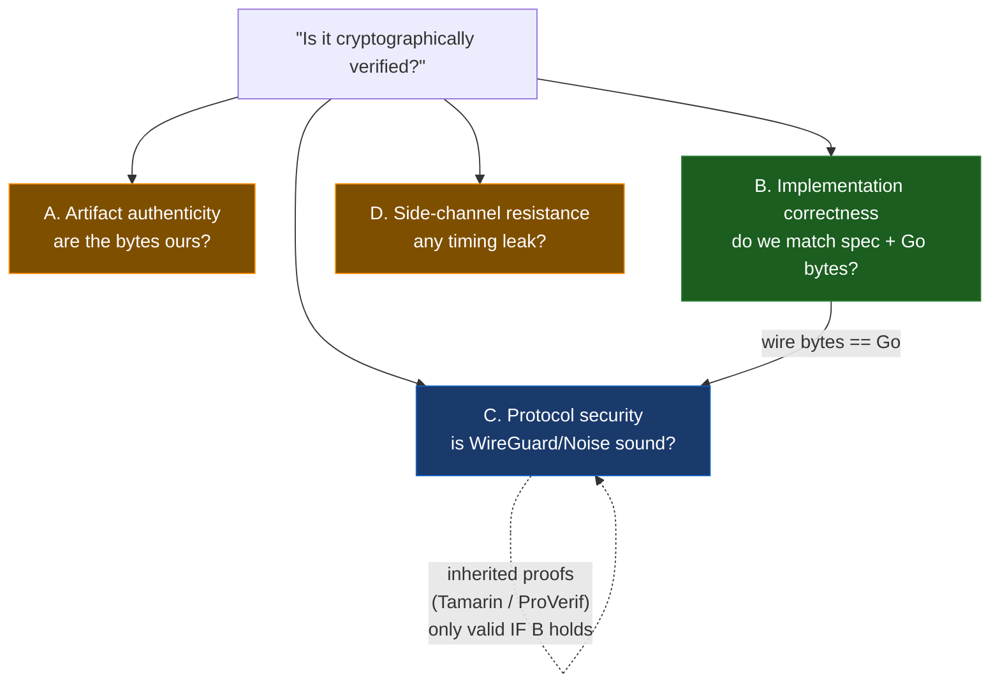
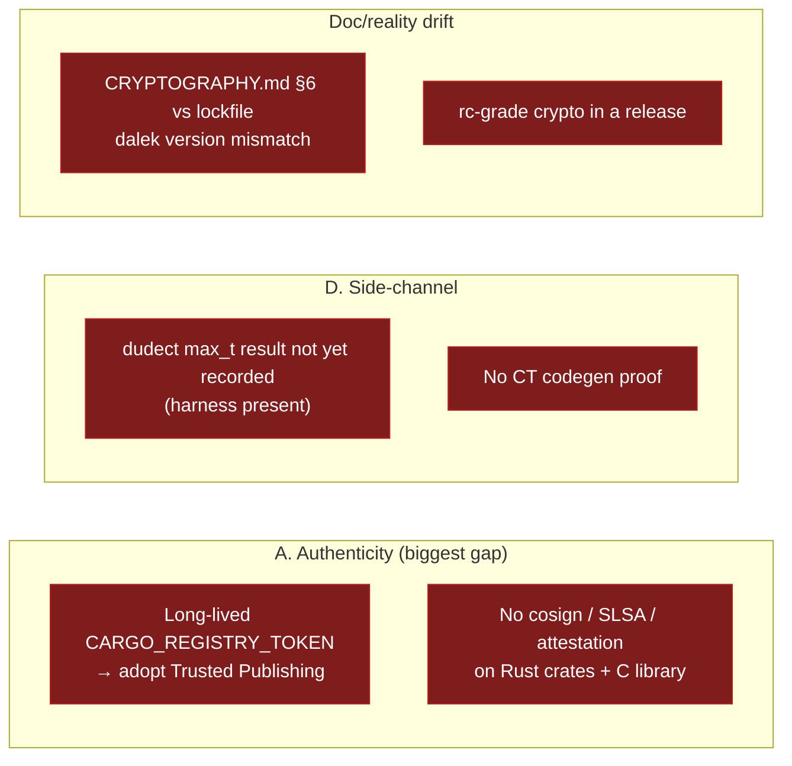

# Cryptographic Verification Status

> **Scope.** This is a *status* document: where `tailscale-rs` (the pure-Rust Tailscale
> implementation, `GeiserX/tailscale-rs`, v0.6.10, 43 crates on crates.io) stands
> cryptographically, and — more importantly — **what "verified" actually means here**.
> For the deep technical reference (per-crate primitives, verifier dispatch, Wycheproof
> tables, threat model), see **[`docs/CRYPTOGRAPHY.md`](./CRYPTOGRAPHY.md)**. This file
> does not duplicate it; it frames it.

## TL;DR

"Cryptographically verify" is **not one problem — it is four**: (A) *artifact authenticity*
(are the installed bytes the bytes we built?), (B) *implementation correctness / interop*
(does our Rust match the spec and reproduce Go's exact wire bytes?), (C) *protocol security*
(is the WireGuard/Noise protocol itself sound?), and (D) *side-channel resistance* (any
secret-dependent timing leak?). Today this fork has strong, real coverage on **B** (Wycheproof
KATs + byte-for-byte Go cross-vectors across all three hand-rolled surfaces) and **inherits C**
from existing academic proofs of WireGuard/Noise **conditional on B holding**. **A is the
largest open gap** (publishing still uses a long-lived registry token; no cosign/SLSA/attestation
on the Rust crates or the C library). **D is detection-only**: the dudect harness source is now
in-tree and runs, but no `max_t` result has been recorded on a quiet machine yet. None of
this substitutes for an independent audit of the hand-rolled crypto — the whole codebase stays
behind `TS_RS_EXPERIMENT=this_is_unstable_software` for exactly that reason.

---

## The four axes of "verified"

The single biggest failure mode in crypto documentation is letting *"we have Wycheproof"* quietly
become *"it is cryptographically verified."* Those are different axes. We track them separately.

| Axis | Question it answers | What it does **not** cover | Tooling (industry) | This fork today |
| ---- | ------------------- | -------------------------- | ------------------ | --------------- |
| **A. Artifact authenticity** | Are the installed bytes the bytes we built, from the source we claim? | Whether the source is *correct* or *safe* | crates.io Trusted Publishing, cosign, SLSA / build provenance, signed tags, checksums | **Partial** — Cargo.lock per-crate SHA256; cargo-deny in CI. Trusted Publishing code present but owner-gated; **no** cosign/SLSA on Rust crates or C lib |
| **B. Implementation correctness / interop** | Does our Rust match the spec, reject what the spec rejects, and emit Go's exact bytes? | Whether the *protocol* built from those primitives is sound | RFC KATs, Wycheproof, Go cross-vectors, fuzzing | **Strong** — Wycheproof (X25519/ChaCha20-Poly1305/Ed25519), Go byte-for-byte vectors on all 3 hand-rolled surfaces |
| **C. Protocol security** | Is the WireGuard / Noise handshake itself sound (KCI, forward secrecy, identity hiding)? | Nonce uniqueness, the concrete state machine, replay handling — those are B/D | Tamarin, CryptoVerif, Noise Explorer (ProVerif) | **Inherited** — we re-prove nothing; we inherit the proofs **iff** our wire bytes match Go (axis B) |
| **D. Side-channel resistance** | Any secret-dependent timing / branch / memory-access leak? | Functional correctness; everything in A/B/C | `subtle`, dudect (**detect**, never prove), cargo-checkct, fiat-crypto | **Partial** — `subtle` constant-time compares, `Zeroizing` key material, RFC-6479 replay window; dudect harness present (`ts_tunnel/benches/constant_time.rs`); no `max_t` result recorded yet |



The dependency edge is the load-bearing claim of this whole document: **C is only as strong as B.**
The academic proofs cover the *abstract* protocol with *ideal* primitives. They transfer to our
code only because our implementation produces the same wire bytes as the reference (Go) — which is
exactly what axis B measures. If B regresses, the inherited proofs no longer apply.

---

## Current coverage (the ~80% already in the tree)

### A — Artifact authenticity (partial)

- **Per-crate content pinning.** `Cargo.lock` records a SHA256 checksum for every dependency.
  Cargo refuses any crate whose download does not match. This is free anti-tamper / anti-MITM on
  the *dependency* side and is why we do **not** separately cosign-sign our own crates (see
  *Deliberately not doing*).
- **Dependency hygiene gates in CI** — `cargo-deny` (advisories, bans, licenses; config in
  [`deny.toml`](../deny.toml)) and `cargo-vet` scaffolding with imported Google/Mozilla audit sets
  ([`supply-chain/config.toml`](../supply-chain/config.toml),
  [`supply-chain/imports.lock`](../supply-chain/imports.lock)). `cargo-audit` is available via the
  Nix dev shell ([`flake.nix`](../flake.nix)).
- **Trusted Publishing exists but is dormant for this fork.** The publish job in
  [`.github/workflows/ci.yml`](../.github/workflows/ci.yml) already uses
  `rust-lang/crates-io-auth-action` (OIDC, `id-token: write`) to mint a short-lived registry
  token — but the whole job is gated `if: github.repository_owner == 'tailscale'`, and the actual
  `cargo ws publish` step still passes a `CARGO_REGISTRY_TOKEN`. This fork releases via git tags,
  so OIDC Trusted Publishing is **wired but not active here**.

### B — Implementation correctness / interop (strong)

**Wycheproof** known-answer vectors (via the `wycheproof` crate), covering the adversarial /
edge-case corpus Google maintains:

| Primitive | Vectors | Test file |
| --------- | ------- | --------- |
| X25519 ECDH | 518 | [`ts_keys/tests/wycheproof_x25519.rs`](../ts_keys/tests/wycheproof_x25519.rs) |
| ChaCha20-Poly1305 AEAD | 316 | [`ts_tunnel/tests/wycheproof_chacha20poly1305.rs`](../ts_tunnel/tests/wycheproof_chacha20poly1305.rs) |
| Ed25519 verify | 150 | [`ts_tka/tests/wycheproof_ed25519.rs`](../ts_tka/tests/wycheproof_ed25519.rs) |

**Go byte-for-byte cross-validation** over all three hand-rolled surfaces. Vectors are generated
from real Tailscale code (pinned to **tailscale v1.100.0** / **golang.org/x/crypto v0.52.0**) and
asserted byte-equal in Rust KATs:

| Surface | Generator | Rust KAT location | What is pinned to Go's bytes |
| ------- | --------- | ----------------- | ---------------------------- |
| WireGuard handshake | [`tests/vectors/gen/wg/main.go`](../tests/vectors/gen/wg/main.go) | [`ts_tunnel/src/handshake.rs`](../ts_tunnel/src/handshake.rs) | Noise handshake keys / key schedule |
| Transport AEAD | [`tests/vectors/gen/aead/main.go`](../tests/vectors/gen/aead/main.go) | [`ts_tunnel/src/session.rs`](../ts_tunnel/src/session.rs) | transport nonce construction |
| Control AEAD | *(part of the Noise/control surface)* | [`ts_control_noise/src/cipher.rs`](../ts_control_noise/src/cipher.rs) | big-endian control-plane AEAD framing |
| Tailnet Lock | [`tests/vectors/gen/tka/main.go`](../tests/vectors/gen/tka/main.go) | [`ts_tka/src/lib.rs`](../ts_tka/src/lib.rs) | `NodeKeySignature` CBOR + SigHash, **and** `AUM` `Serialize`/`Hash`/`SigHash` (one AUM per kind) |
| ZIP-215 verify | [`tests/vectors/gen/zip215/main.go`](../tests/vectors/gen/zip215/main.go) | [`ts_tka/src/lib.rs`](../ts_tka/src/lib.rs) | dual-verifier (ZIP-215 vs standard) vs Go |

Plus the **12-vector `ed25519-speccheck` dual-verifier KAT**
([`ts_tka/src/lib.rs`](../ts_tka/src/lib.rs), `ed25519_speccheck_dual_verifier_kat`), which proves
the standard (cofactorless, `ed25519-dalek`) vs ZIP-215 (cofactored, `ed25519-zebra`) dispatch
agrees with Go's accept/reject behavior on the 12 adversarial Ed25519 edge cases.

**AUM `Serialize`/`Hash`/`SigHash` Go cross-vector (new).** The Go vector generator
([`tests/vectors/gen/tka/main.go`](../tests/vectors/gen/tka/main.go)) now also imports the real
`tailscale.com/tka` and dumps, for one `tka.AUM` per `MessageKind` (AddKey, RemoveKey, UpdateKey, a
signed AddKey with `Signatures` at CBOR key 23, and a Checkpoint with a populated `State`), the
authoritative `AUM.Serialize()` / `AUM.Hash()` (`BLAKE2s-256` of the serialization) /
`AUM.SigHash()` (`BLAKE2s-256` of the serialization with `Signatures` nil'd) — committed at
[`tests/vectors/tka_aum_hash_golden.json`](../tests/vectors/tka_aum_hash_golden.json). The Rust KAT
`aum_hash_sighash_matches_go_golden` asserts `Aum::serialize`/`hash`/`sig_hash` byte-match those Go
goldens. This closes the one residual axis-B gap for Tailnet Lock: the prior
`aum_serialize_matches_go_test_serialization_vectors` test pinned only Go's *Serialize()* literals
(from `tka/aum_test.go`); **no Go-produced `AUM.Hash()` digest was pinned**, so an error in the
BLAKE2s-over-canonical-CBOR digest — the value that links the whole chain and is what gets signed —
could have gone undetected. The signed-AddKey case also proves `Hash() != SigHash()` (key 23 is in
`Hash`, excluded from `SigHash`), matching Go's `AUM.SigHash` which nils `Signatures` first.
Provenance is a **real Go run**, not literal-derivation: regenerating with the in-tree generator
(`go run ./tka`, `tailscale.com v1.100.0`, toolchain go1.26.3) reproduces
`tka_aum_hash_golden.json` **byte-for-byte**, and a standalone Go oracle confirms `AUM.Hash() ==
blake2s.Sum256(Serialize())` and `SigHash() == blake2s.Sum256(Serialize-with-Signatures-nil)` for
every case, with `blake2s.Size == 32` (BLAKE2s-**256**, not BLAKE2b).

> ✅ **One Go-interop divergence found by this audit — now FIXED (nil-vs-empty `DisablementValues`).**
> For an `AUMCheckpoint` whose embedded `State.DisablementValues` (or `Keys`) is **nil** (the Go zero
> value, and the common case), Go's `fxamacker/cbor` emits CBOR null `0xf6`; Rust's `AumState`
> originally modelled the field as `Vec<Vec<u8>>` and always emitted an empty array `0x80`, diverging
> the checkpoint's `Hash`/head from Go on the **chain-replay** path (the shipped `node_key_authorized`
> verify path never serializes an `AumState`, so it was never affected). **Fixed:**
> `AumState.{disablement_values,keys}` are now `Option<Vec<…>>` — `None` (Go nil) encodes as null
> `0xf6`, `Some(vec)` as an array — so the nil case byte-matches Go. The regression guard is now a
> **passing** Go-match golden (`aum_checkpoint_nil_disablement_matches_go`, pinning both the Go
> serialization and the Go `Hash`), alongside the populated case in `aum_hash_sighash_matches_go_golden`.

**BLAKE2s-256 reference KAT.** BLAKE2s was previously the only hand-rolled primitive exercised
*only* transitively (through the WireGuard handshake vectors). It now has a direct KAT
([`ts_tunnel/tests/blake2s_kat.rs`](../ts_tunnel/tests/blake2s_kat.rs),
`blake2s256_reference_kat`): **15 vectors (8 unkeyed + 7 keyed)** from the canonical BLAKE2
reference set (`github.com/BLAKE2/BLAKE2`, `testvectors/blake2-kat.json`), covering both the
unkeyed hash (`Blake2s256` — transcript hash, mac1, HKDF chaining-key expansion) and the keyed
MAC (`Blake2sMac256` — mac2/cookie MAC). Vectors are embedded inline and committed as JSON
provenance at [`tests/vectors/blake2s_kat.json`](../tests/vectors/blake2s_kat.json). Runs in the
normal `cargo test` gate.

**CBOR differential fuzz target (Tailnet Lock).** A `libfuzzer` target
([`ts_tka/fuzz/fuzz_targets/cbor_decode.rs`](../ts_tka/fuzz/fuzz_targets/cbor_decode.rs)) drives
`Authority::node_key_authorized` with arbitrary bytes, exercising the hand-written
`NodeKeySignature` CBOR decoder the way a hostile peer would and asserting it is panic-free /
DoS-safe and fails closed. It pairs with a Go oracle
([`tests/vectors/gen/cbor_diff/`](../tests/vectors/gen/cbor_diff/)) that decodes the same bytes
with Tailscale's `github.com/fxamacker/cbor` for accept/reject comparison. **Scope:** the fuzz
target needs **nightly + `cargo-fuzz`**, so it does **not** run in normal CI — but a stable-CI smoke
test ([`ts_tka/tests/cbor_decode_smoke.rs`](../ts_tka/tests/cbor_decode_smoke.rs)) feeds hand-crafted
malformed/over-nested CBOR to the same `node_key_authorized` entry on every `cargo test` run,
asserting the panic-free / fail-closed invariant in stable CI. The automated Rust↔Go differential
loop (wiring the fuzzer to the Go oracle) is tracked as follow-on work.

### C — Protocol security (inherited, not re-proven)

The data-plane handshake is **`Noise_IKpsk2_25519_ChaChaPoly_BLAKE2s`** — the exact WireGuard
construction. We do **not** re-prove the protocol. We inherit:

- **WireGuard's symbolic-model proof** (Donenfeld & Milner, Tamarin) —
  <https://www.wireguard.com/formal-verification/> ·
  <https://git.zx2c4.com/wireguard-tamarin>
- **Noise `IK` pattern analysis** (Noise Explorer, ProVerif) —
  <https://noiseexplorer.com/patterns/IK/>

**What these proofs cover:** the abstract protocol's secrecy and authentication properties
(forward secrecy, KCI resistance, identity hiding) assuming *ideal* primitives.
**What they explicitly do NOT cover** (and therefore stays on axes B / D):

- nonce uniqueness in our concrete counter implementation,
- our concrete handshake **state machine** (ordering, retries, rekey),
- **replay** handling.

This inheritance is conditional: it holds **only because axis B shows our wire bytes match the
reference**. It is not a free-standing claim about our code.

### D — Side-channel resistance (detection posture only)

- **Constant-time comparisons.** Certificate-pin equality uses `subtle::ConstantTimeEq`
  ([`ts_tls_util/src/pinned.rs:99`](../ts_tls_util/src/pinned.rs) — `got.as_ref().ct_eq(&self.pin_sha256)`).
- **Key-material zeroization.** `Zeroizing` wraps secrets in
  [`ts_keys/src/keystate.rs`](../ts_keys/src/keystate.rs) and
  [`ts_control_noise/src/handshake.rs`](../ts_control_noise/src/handshake.rs).
- **Replay window.** RFC-6479 sliding window in
  [`ts_tunnel/src/replay.rs`](../ts_tunnel/src/replay.rs), property-tested with `proptest`.
- **Primitive-level CT** is delegated to `curve25519-dalek` (fiat-crypto backend) and RustCrypto —
  see `docs/CRYPTOGRAPHY.md` §“Constant-time” for the per-operation breakdown.

> ⚠️ **dudect harness is present, but no clean-machine `max_t` is committed yet.**
> [`ts_tunnel/Cargo.toml`](../ts_tunnel/Cargo.toml) declares the `dudect-bencher` dependency and a
> `[[bench]]` target (`harness = false`), and the harness source now exists at
> [`ts_tunnel/benches/constant_time.rs`](../ts_tunnel/benches/constant_time.rs) — it builds and
> runs (a Welch t-test over the ChaCha20-Poly1305 AEAD tag-verify path). It is **informational and
> deliberately not CI-gated**: the t-statistic is flaky on shared runners (a noisy box empirically
> emits `max_t ≈ 20`, which would red-flag essentially every build if gated). The one true residual
> gap is therefore narrow: **no `max_t` measurement from a quiet machine has been committed yet** —
> the harness exists and is runnable, but no recorded result is in the tree.

---

## Gaps / in progress (the remaining ~20%)



**A — authenticity (the largest real gap, actively being closed):**
- Migrate the publish path off the long-lived `CARGO_REGISTRY_TOKEN` to **crates.io Trusted
  Publishing** for *this* repo (the OIDC plumbing already exists in `ci.yml`; it just needs the
  owner gate replaced with this fork's identity).
- Add **cosign / SLSA build provenance / `gh attestation`** to the **Rust crate** and **C-library**
  release artifacts. Today only the Python and Elixir bindings emit `attestations`
  ([`.github/workflows/python.yml`](../.github/workflows/python.yml),
  [`.github/workflows/elixir.yml`](../.github/workflows/elixir.yml)); the C library in
  [`.github/workflows/release-binaries.yml`](../.github/workflows/release-binaries.yml) is uploaded
  with a plain `gh release upload` and **no attestation**.

**B — correctness:** strong, with **one recorded byte-level divergence** (not a verify-path gap). The two previously-listed items both landed in this change and
are documented under *Current coverage → B* above: the direct **BLAKE2s-256 KAT**
([`ts_tunnel/tests/blake2s_kat.rs`](../ts_tunnel/tests/blake2s_kat.rs)) and the **CBOR differential
fuzz target** for Tailnet Lock ([`ts_tka/fuzz/fuzz_targets/cbor_decode.rs`](../ts_tka/fuzz/fuzz_targets/cbor_decode.rs)
+ Go oracle [`tests/vectors/gen/cbor_diff/`](../tests/vectors/gen/cbor_diff/)). What remains is
*follow-on* hardening, not a correctness gap: wiring the fuzzer's Rust↔Go accept/reject comparison
into an automated differential loop (it needs nightly + `cargo-fuzz`, so it stays out of normal CI —
the decoder's panic-free invariant is already covered in stable CI by
[`ts_tka/tests/cbor_decode_smoke.rs`](../ts_tka/tests/cbor_decode_smoke.rs)). The **AUM `Serialize`/`Hash`/`SigHash`** surface is now Go-cross-validated too (see *Current
coverage → B*), closing the prior "no Go-produced `AUM.Hash()` pinned" gap. The one Go-interop
divergence this audit surfaced — the **nil-vs-empty `DisablementValues`** encoding in `AumState`
(Go null `0xf6` vs Rust empty-array `0x80`, which affected only the chain-replay `Hash`, never the
shipped verify path) — has since been **fixed**: `AumState.{disablement_values,keys}` are now
`Option`, so a nil slice encodes as `0xf6` and the nil-checkpoint case byte-matches Go (regression
guard: the passing `aum_checkpoint_nil_disablement_matches_go` golden). Axis B has no open
correctness divergence on the Tailnet-Lock surface.


**D — side-channel (in progress):**
- **Record a `max_t` result on a quiet machine.** The dudect harness source now exists
  ([`ts_tunnel/benches/constant_time.rs`](../ts_tunnel/benches/constant_time.rs)) and runs; the
  remaining gap is that no clean-machine measurement is committed (it is informational and
  intentionally not CI-gated — see the axis-D note above).
- No **constant-time codegen proof** (e.g. `cargo-checkct`); detection ≠ proof, and we have neither
  a recorded detection result nor the proof today.

**Doc / reality drift (being corrected):**
- `docs/CRYPTOGRAPHY.md` §6 documents the dalek floor as `curve25519-dalek 4.1.3` /
  `x25519-dalek 2.x` / `ed25519-dalek 2.2.0`, but `Cargo.lock` actually resolves the
  **release-candidate line** as well: `x25519-dalek 3.0.0-rc.0` →
  `curve25519-dalek 5.0.0-rc.0` (and `ed25519-dalek 3.0.0-rc.0`). The deep doc is out of sync with
  the lockfile and must be reconciled.
- **Shipping rc-grade crypto in a published release is flagged.** `*-rc.0` dependencies are
  pre-stable; depending on them in a tagged v0.6.10 release is a risk to call out, not hide.

---

## Deliberately not doing (not theater)

Verification work has a cost, and some popular-sounding controls are redundant or premature here.
We are **intentionally** skipping the following — this is a decision, not an oversight:

- **Cosign-signing the crates themselves.** Redundant with Trusted Publishing (provenance at the
  source) plus Cargo's per-crate SHA256 in `Cargo.lock` (which already gives anti-MITM / anti-tamper
  for free). Attestation belongs on the *build artifacts*, not on each `.crate`.
- **Reproducible builds — deferred.** Bit-for-bit reproducibility is hard in Rust today and is
  low-payoff *before* an independent audit. Revisit post-audit.
- **Rebuilding the protocol proofs.** We **reuse** WireGuard/Noise's existing Tamarin/ProVerif work
  (axis C). Re-deriving them would be enormous effort for zero marginal assurance over matching Go
  bytes.
- **Swapping the crypto stack to `libcrux` (pre-0.1) or `hax`.** `libcrux` is pre-release;
  `hax`-style F\* verification carries a large proof-engineering cost. Neither is justified now;
  the current `ring` + RustCrypto + dalek stack is the pragmatic choice pre-audit.

---

## Residual risk

Stated plainly, mirroring [`SECURITY.md`](../SECURITY.md)'s candor:

- **No supply-chain control stops a malicious or compromised maintainer.** Trusted Publishing,
  cosign, and SLSA prove *who built it* and *that it wasn't altered in transit* — they do **not**
  prove the source is benign. The XZ backdoor (**CVE-2024-3094**) was introduced *by* a trusted
  maintainer and would have sailed through every authenticity control above.
- **None of this replaces an independent cryptographic audit.** The hand-rolled surfaces — the
  **Noise handshake state machine** and the **Tailnet Lock signature chain** — have *not* been
  audited. KATs and cross-vectors give functional correctness and interop, not a security review.
- **The whole library is gated behind `TS_RS_EXPERIMENT=this_is_unstable_software`** for this exact
  reason. Per `SECURITY.md`, that gate stays until an independent audit lands and any resulting
  fixes ship. Do not remove it to make a build look production-ready.

---

## Verification cheat-sheet

What a consumer or auditor can run **today**:

```bash
# B — implementation correctness / interop (Wycheproof + Go cross-vectors, all in-tree KATs)
cargo test --workspace

# Narrow to the crypto-bearing crates:
cargo test -p ts_keys -p ts_tunnel -p ts_tka -p ts_control_noise

# A — dependency hygiene (advisories / bans / licenses)
cargo deny check

# A — per-crate content pinning is automatic: Cargo verifies every
#     dependency's SHA256 against Cargo.lock on fetch (no command needed).
```

What will exist **once axis A lands** (not available yet — tracked above):

```bash
# A — verify build provenance / attestation on a released artifact
gh attestation verify <artifact> --repo GeiserX/tailscale-rs

# A — verify a detached signature on a release blob
cosign verify-blob --signature <sig> --certificate <cert> <artifact>
```

---

*Companion to [`docs/CRYPTOGRAPHY.md`](./CRYPTOGRAPHY.md) (the deep reference) and
[`SECURITY.md`](../SECURITY.md) (threat model + audit status). This file is the map of "what
'verified' means"; those files are the territory.*
