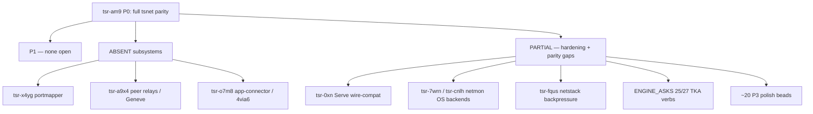

# tsnet → Rust migration: what's left

A complete status of the pure-Rust Tailscale engine (`tailscale` facade + 45 `ts_*` crates) versus
Go `tsnet`/`tailscaled` v1.100.0. This is the orienting map for "what remains"; the live backlog is
the beads (`bd list --status open`, prefix `tsr-`) — every open bead is cross-referenced below.

> **Bottom line.** The core path is **production-complete**: a node registers over TS2021-Noise,
> long-polls the netmap (zstd-framed), brings up MagicSock/disco/DERP + the WireGuard tunnel and the
> userspace netstack, runs MagicDNS, enforces the packet filter and Tailnet Lock, serves Taildrop /
> Serve / SSH / Funnel, and recovers from key-expiry and link changes on its own. What remains is
> **edge-clustered**: two genuinely-absent subsystems (NAT port-mapping, app-connector data path), a
> set of partial subsystems with named hardening/parity gaps, and a tail of small surface polish. None
> of it blocks the engine's mission (embed a Tailscale node + the residential-proxy exit path).

*Last updated: 2026-06-16. Engine at v0.41.0 (crates.io). Beads: 35 open + 2 in-progress under the P0
epic `tsr-am9`.*

---

## 1. Subsystem completeness

Verdict legend: **PRESENT** = works, no material gap · **PARTIAL** = works with named gaps · **ABSENT**
= not implemented.

| Subsystem | Verdict | Notes | Open beads |
|---|---|---|---|
| Control protocol (register/auth, map-poll, Noise/TS2021, zstd, capver) | **PRESENT** | + auto-reauth on key expiry, NeedsMachineAuth-transient, zstd map responses, Container/Env hostinfo — all shipped this cycle | parity polish: `tsr-84mh`, `tsr-cbw4`, `tsr-ajyc` |
| MagicSock / disco / direct paths | **PARTIAL** | STUN/DERP/CallMeMaybe/ping-pong/best-addr work; **portmapper absent**, **peer-relays absent** | `tsr-x4yg` (portmapper), `tsr-a9x4` (peer relays), `tsr-dsjq` (full netcheck), `tsr-7s3` (ping cadence), `tsr-qc3o` (NoPath demand-ping), `tsr-51o6` (flaky test) |
| WireGuard tunnel | **PARTIAL** | initiator path complete (handshake/session/rekey/replay/cookie-consume); responder cookie issuance missing | `tsr-rl3n` (responder cookie + IsUnderLoad), `tsr-qn2` (MTU-aware padding) |
| Netstack (userspace TCP/IP + TUN) | **PARTIAL** | TCP/UDP both modes; needs backpressure + icmp-echo | `tsr-fqus` (unbounded ingress queue, DoS), `tsr-rsu` (auto-icmp-echo), `tsr-4pp` (per-session sharding) |
| MagicDNS | **PARTIAL** | responder + plain-UDP upstream + recursive (TUN) work; encrypted upstream dropped | `tsr-3l78` (DoH/DoT upstream), `tsr-i2w` (exit-node DoH authoritative-vs-forward) |
| Packet filter | **PARTIAL** | stateless by design (no conntrack) | `tsr-ohp` (no runIn conntrack — design decision), `tsr-4obf` (IPv6 frag ext-headers, moot while IPv4-only) |
| Tailnet Lock (TKA) | **PARTIAL** | **actively enforcing, fail-closed**; init/sign/disable/status + `tka_log` shipped; add/remove/local-disable designed-not-built | add/remove/log/local-disable = ENGINE_ASKS #25/#27 (see §4); hardening (disablement-secret verify, rotation-obsolete) tracked under `tsr-am9` |
| Taildrop / PeerAPI | **PARTIAL** | full send/receive data path works | `tsr-dlzn` (cap enforcement membership-only), `tsr-cvh` (resume hash-exchange + header gaps) |
| Serve / Funnel | **PARTIAL** | all handlers (Path/Redirect/Proxy/Text/TcpForward) + funnel client leg ship | `tsr-0xn` (ServeConfig not Go-wire-compatible, 8 deviations), `tsr-am9.11` (Funnel public relay leg — externally blocked) |
| SSH server | **PARTIAL** | login-shell PTY works | `tsr-v5gw` (no exec/SFTP/port-forward; userLogin principals), `tsr-0h2` (check-mode HoldAndDelegate) |
| Exit nodes / subnet routes (using) | **PRESENT** | accept-routes + exit-node + `suggest_exit_node` shipped; advertising-side is out of scope by design | — |
| netmon / link-change | **PARTIAL** | supervisor + debouncer + rebind/re-probe (slice a) shipped; OS event sources pending | `tsr-7wrn` (Linux netlink), `tsr-cnlh` (macOS PF_ROUTE) |
| App-connector / 4via6 | **ABSENT** | advertise-bool only (`HostInfo.AppConnector`); no domain-routing data path | `tsr-o7m8` |
| ACME / cert | **PARTIAL** | full issuance works | `tsr-pyc9` (no cert cache → re-issues, rate-limit risk) |

---

## 2. Intentional supersets — NOT migration gaps

These are deliberate, CI-enforced (the `checks` crate) fork choices. Do **not** file them as missing
parity — several are *stricter* or *additive* versus Go.

- **IPv4-only tailnet/egress** — enforced by `checks` (`ipv4_only_forwarder`, `ipv4_only_host_net`),
  `SECURITY.md`. (This is why `tsr-4obf` IPv6-frag handling is "moot while IPv4-only".)
- **Fail-closed egress** — the `RealDialer` chokepoint never falls back to a host-IP dial; any
  proxy/exit failure drops the flow. `DirectDialer` structurally refuses exit egress.
- **Ring-clean / pure-Rust crypto** (stricter than "ring-only" — no aws-lc/openssl on the default
  graph; `ssh` feature is the only aws-lc path) — keeps the egress/proxy daemon musl-static.
- **Exit-node residential-proxy egress** — a capability Go `tsnet` does **not** have: an exit node can
  egress forwarded traffic through an upstream residential proxy (SOCKS5 / HTTP CONNECT, zero new
  deps). Documented in `AGENTS.md` as "beyond strict tsnet parity".

---

## 3. Public API surface (Device / facade vs tsnet)

The `Device` facade is a **near-complete tsnet superset**. It covers all of `tsnet.Server`'s
lifecycle/dial/listen surface and most of `LocalClient` (Status/WhoIs/cert/serve/funnel/prefs-edit/
ping/netcheck/DNS/TKA), plus extras Go has no equivalent for (typed accessors instead of a LocalAPI
socket; exit-node proxy egress; `new_with_secret`; `re_stun`; `suggest_exit_node`).

**Missing or partial surface** (each maps to a bead):

| Go tsnet / LocalClient | Fork status | Bead |
|---|---|---|
| Serve stored-state runtime + accept-loop; `ServeConfig` wire-compat | PARTIAL (handlers ship; 8 wire deviations) | `tsr-0xn` |
| `Server.Loopback` HTTP-proxy half + SOCKS5 UDP ASSOCIATE + LocalAPI-over-HTTP | PARTIAL (SOCKS5-CONNECT only; native typed accessors instead) | `tsr-ask7` |
| `Status`/`WhoIs` per-peer `online`/`last_seen` | MISSING (reported `None`; wire delivers them) | `tsr-x72n` |
| `LocalClient.Netcheck` full `netcheck.Report` | PARTIAL (DERP-latency + HTTPS only) | `tsr-dsjq` |
| `Server.Logf`/`UserLogf`, `Port`-pin equivalence, `RunWebClient`, `Sys()` | MISSING / by-design substitute | `tsr-reh3` |
| `ListenFunnel` public ingress relay leg | PARTIAL — externally blocked (Tailscale infra) | `tsr-am9.11` |
| README ↔ SECURITY.md ↔ rustdoc reconciliation (README understates TKA/ACME/Taildrop as "Unsupported" when they ship) | doc debt | `tsr-j5z4` |

---

## 4. Downstream daemon (`tailscaled-rs`) engine-asks

The sibling daemon tracks what it needs from this engine in its `docs/ENGINE_ASKS.md` (#1–#27). Status
after this cycle:

**Shipped (consumable on a pin bump to ≥ v0.40.0 / v0.41.0):**
- #1 `TransportMode`/`TunConfig` re-export · #2 `new_with_secret` · #3 zeroize keys · #4 `rebind` ·
  #5/#6 macOS TUN name/route · #9–#12 live setters / `dns_config` / `netcheck` / shields-up ·
  #13 funnel re-exports · #14 `accept_dns` · #15 `query_dns` · #16 `cert_pair` · #17 TKA mutation
  (init/sign/disable) · #19 TUN peer-AllowedIPs · #20 Taildrop arrival.
- **This cycle (v0.40.0 / v0.41.0):** #22 `wireguard_listen_port` (`--port`) · #23 `StatusNode.ssh_host_keys`
  (`tnet ssh` known_hosts) · #26 `Device::re_stun` (`tnet debug restun`) · #24 `suggest_exit_node`
  (`tnet exit-node suggest`) · #21 the up/set pref Config fields (operator/nickname/posture/webclient/
  auto-update/app-connector/exit-node-allow-lan) · #21-subask `identity-federation` compiles (the 4 WIF
  flags need only the feature flag, zero engine code).

**Remaining engine-asks (the immediate "what's left" for the daemon):**
- **#25** `Device::tka_add`/`tka_remove`/`tka_log` — `tka_log` shipped (this cycle); add/remove
  designed (`docs/research/loop-asks25-27-tka-verbs.md`), consensus-critical, not yet built.
- **#27** `Device::tka_local_disable` — designed, not yet built.
- **#7 / #18 / #28** SSH session-recording transport (CastV2) + check-mode, Windows host-net router,
  SSH recorder — deferred/lower-priority.
- **auto-update / webclient behavioral subsystems** — per direction, these are to mirror Go's
  *behavior* (a real updater + web client), not just carry the pref → genuinely large separate efforts.

---

## 5. The remaining backlog, by priority

**P0** — `tsr-am9` (the umbrella epic; "done" when the children below close).

**P1** — none open (the two P1 bugs this cycle — auto-reauth `tsr-ajvm`, NeedsMachineAuth `tsr-dvu` —
are merged + closed).

**P2 (next-highest leverage):**
- `tsr-doz6` netmon (in-progress: slice a shipped; `tsr-7wrn` Linux + `tsr-cnlh` macOS backends remain)
- `tsr-x4yg` portmapper (UPnP-IGD/NAT-PMP/PCP) — EPIC; direct paths behind mapping-NATs stay on DERP
- `tsr-0xn` Serve Go-wire-compatibility (8 deviations)
- `tsr-fqus` netstack ingress backpressure (authenticated-peer RAM-exhaustion DoS)
- `tsr-7s3` magicsock ping cadence / path-selection parity (in-progress)
- `tsr-4pp` netstack per-session sharding (k8s scale)

**P3 (the long tail — ~22 beads):** `tsr-a9x4` peer relays, `tsr-o7m8` app-connector/4via6, `tsr-3l78`
encrypted-upstream DNS, `tsr-v5gw` SSH exec/SFTP, `tsr-ask7` loopback HTTP/UDP, `tsr-dlzn`/`tsr-cvh`
peerapi gaps, `tsr-dsjq` full netcheck, `tsr-x72n` peer online/last_seen, `tsr-pyc9` cert cache,
`tsr-reh3` tsnet API knobs, `tsr-am9.11` Funnel relay leg, `tsr-i2w` exit-node DNS, `tsr-rl3n` responder
cookie, `tsr-rsu` icmp-echo, `tsr-ohp` conntrack, `tsr-4obf` IPv6 frag, `tsr-qc3o` demand-ping,
`tsr-qn2` MTU padding, `tsr-u5x` host-FIB re-steer, `tsr-iyv` UDP-flows config, `tsr-84mh`/`tsr-cbw4`/
`tsr-ajyc` control parity polish, `tsr-3l78`, `tsr-0h2` SSH check-mode, `tsr-1rs`/`tsr-51o6` flaky-test
hardening, `tsr-j5z4` docs reconciliation.

> For the authoritative, always-current list: `bd list --status open` (and `bd show <id>` for the full
> write-up of any item). This doc is the orienting map; the beads are the source of truth.

---

## 6. Externally-blocked (cannot build against self-hosted control — not engine work)

Listed so they aren't mistaken for engine debt: ACME-over-control RPC (a self-hosted control plane may
501 on `set-dns`), OIDC/SSO login, network flow logs, relayed Taildrop, cross-tailnet node sharing, and
the Funnel public ingress relay leg (Tailscale infra). These depend on Tailscale-operated services, not
on this engine.
