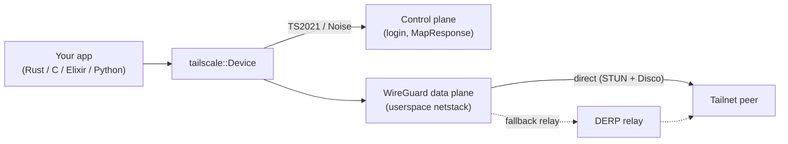

# How it works

A `Device` joins the tailnet by authenticating to the **control plane** over Tailscale's
TS2021 (Noise) channel, then moves data over an in-process **WireGuard** data plane — connecting
peer-to-peer where NAT traversal allows, and relaying through **DERP** otherwise.

For the full module layout and design notes, see [ARCHITECTURE.md](https://github.com/GeiserX/tailscale-rs/blob/main/ARCHITECTURE.md).

