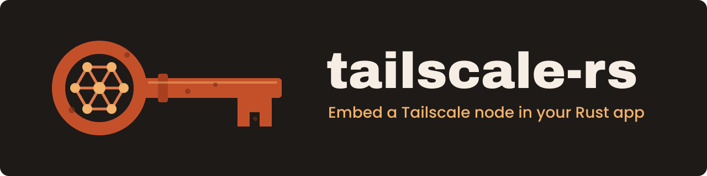

---
hide:
  - navigation
---

# tailscale-rs { .tr-visually-hidden }

<p align="center">
  
</p>

<p align="center">
  <a href="https://crates.io/crates/geiserx_tailscale"></a>
  <a href="https://crates.io/crates/geiserx_tailscale"></a>
  <a href="https://github.com/GeiserX/tailscale-rs/stargazers"></a>
  <a href="https://github.com/GeiserX/tailscale-rs/blob/main/LICENSE"></a>
</p>

---

**tailscale-rs** is a work-in-progress Tailscale library written in Rust. Your program joins a tailnet as its own node, from inside its own process, and opens TCP and UDP sockets to the other nodes: direct peer to peer where NAT traversal allows, through DERP relays where it does not. Go programs get this from Go's `tsnet`; tailscale-rs brings it to Rust, with an optional `tsnet::Server` facade shaped like Go's, and to C, Elixir and Python through bindings. It talks to the Go client, `tsnet` and `libtailscale`. Start with [Getting started](getting-started.md), and read [Caveats](caveats.md) before you depend on it.

!!! warning "Unstable and unaudited"

    The cryptography has not been audited and the API has no compatibility guarantees yet. Do not build production software on it or rely on it for data privacy. Every program linked against it must set `TS_RS_EXPERIMENT=this_is_unstable_software`. See [Caveats](caveats.md).

<div class="grid cards" markdown>

-   :material-package-variant: **[Getting started](getting-started.md)**

    ---

    Add the crate, published as `geiserx_tailscale` and imported as `tailscale`, and set `TS_RS_EXPERIMENT`.

-   :material-play-circle-outline: **[A first program](getting-started.md#code-sample)**

    ---

    A UDP client that joins the tailnet with an auth key and sends a packet to a peer every second.

-   :material-swap-horizontal: **[Coming from Go `tsnet`](getting-started.md#tsnet-facade-go-idiomatic-server)**

    ---

    The `tsnet` feature's `Server`: settable fields, lazy start, `listen`, `dial`, and a Go-to-Rust mapping table.

-   :material-book-open-variant: **[API reference](https://docs.rs/geiserx_tailscale)**

    ---

    Every type and method of the `tailscale` crate on docs.rs, for the published version.

</div>

## What it looks like

A node that joins the tailnet as `web` and accepts TCP connections on port 80, with the `tsnet` feature, next to the Go it replaces:

=== "Rust"

    ```rust
    use tailscale::tsnet::Server;

    let mut srv = Server::new();
    srv.hostname = Some("web".into());
    srv.auth_key = Some("YOUR_AUTH_KEY_HERE".into());
    srv.dir = Some("web_state".into());

    // The node starts on the first method call.
    let listener = srv.listen("tcp", ":80").await?;
    ```

=== "Go tsnet"

    ```go
    srv := &tsnet.Server{Hostname: "web", AuthKey: key, Dir: "web_state"}
    defer srv.Close()
    ln, _ := srv.Listen("tcp", ":80")
    ```

The full program, the dependency lines and the plain `Device` API without the facade are on [Getting started](getting-started.md). The [`examples/`](https://github.com/GeiserX/tailscale-rs/blob/main/examples/README.md) directory has runnable programs: an `axum` web page, a UDP ping, a TCP echo server, the same server on the facade, and an SSH-served peer lookup.

## What works today

- TCP and UDP sockets on the tailnet from an in-process WireGuard data plane.
- Direct connections through NAT traversal (STUN, Disco, `CallMeMaybe`), falling back to DERP relays.
- MagicDNS and split DNS, fail-closed by default.
- Using subnet routers and exit nodes (opt-in), with the exit node changeable at runtime.
- Tailscale Serve handlers, and Tailnet Lock peer signature enforcement (partial).

The full list, with what is coming and what is not supported, is on [Status](status.md). How a node reaches the control plane and its peers is on [How it works](how-it-works.md).

## What it does not do yet

- Act as an exit node or a subnet router for other nodes. Using one works.
- Peer relays, private DERP relays, Taildrop, Taildrive and automatic key rotation.
- Hole-punch symmetric NATs; behind some NATs a flow stays relayed through DERP, which caps its throughput.
- Run on Android, iOS or the BSDs. It runs on Linux (x86_64, ARM64), macOS (ARM64) and Windows (x86_64), with Rust 1.94.1 or newer. See [Caveats](caveats.md#platform-support).

## Other languages

The C, Elixir and Python bindings live in this repository and build from it: [C](https://github.com/GeiserX/tailscale-rs/blob/main/ts_ffi/README.md), [Elixir](https://github.com/GeiserX/tailscale-rs/blob/main/ts_elixir/README.md), [Python](https://github.com/GeiserX/tailscale-rs/blob/main/ts_python/README.md). Each README has a code sample. The same `TS_RS_EXPERIMENT` rule applies.

## Getting help

- Something does not work: open an [issue](https://github.com/GeiserX/tailscale-rs/issues) with the steps to reproduce it.
- A security problem: report it privately through a [GitHub security advisory](https://github.com/GeiserX/tailscale-rs/security/advisories/new), as the [security policy](https://github.com/GeiserX/tailscale-rs/blob/main/SECURITY.md) says, never in a public issue.
- Building, testing and the code layout: [CONTRIBUTING.md](https://github.com/GeiserX/tailscale-rs/blob/main/CONTRIBUTING.md) and [ARCHITECTURE.md](https://github.com/GeiserX/tailscale-rs/blob/main/ARCHITECTURE.md). Release notes: [CHANGELOG.md](https://github.com/GeiserX/tailscale-rs/blob/main/CHANGELOG.md).

## License

tailscale-rs is released under the [BSD-3-Clause](https://github.com/GeiserX/tailscale-rs/blob/main/LICENSE) license. It is a fork of [tailscale/tailscale-rs](https://github.com/tailscale/tailscale-rs) and is not associated with Tailscale Inc. "Tailscale" is a trademark of Tailscale Inc., used here only to describe interoperability and the upstream project. WireGuard is a registered trademark of Jason A. Donenfeld.
