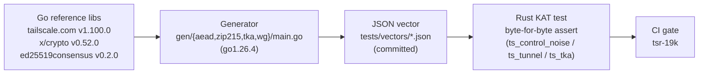

# Cross-implementation crypto test vectors

These JSON files are **Go-sourced known-answer test (KAT) vectors**. They exist to prove that the
fork's hand-rolled cryptography is **byte-for-byte interoperable with Go Tailscale**. Every
hand-rolled surface here (the big-endian control AEAD, the WireGuard Noise state machine, and the
TKA CBOR/SigHash/verifier dispatch) is otherwise validated only by self-consistent round-trips,
which cannot catch a wire-incompatibility with the real Go implementation.

A divergence from these vectors **fails closed** — denied auth, a failed handshake, or a TKA
consensus split — rather than silently weakening security. But fail-closed still **breaks real
interop**: a peer that disagrees on a byte cannot complete a handshake or agree on the trusted-key
set. These vectors are the guard against that silent wire-incompatibility. They back issue
**tsr-19k** ("prove byte-for-byte interop with Go").

## Vector files

| File | Surface it covers | Go source library + version | Asserted on the Rust side |
|---|---|---|---|
| `control_noise_be_aead.json` | Control plane (TS2021) transport AEAD with the **big-endian** nonce counter | `golang.org/x/crypto/chacha20poly1305` v0.52.0 | The forked `ChaCha20Poly1305BigEndian` (the `to_le_bytes` → `to_be_bytes` edit in `ts_control_noise`) produces the identical ciphertext + Poly1305 tag for each `(key, counter, ad, pt)`. |
| `wireguard_handshake_transport.json` | WireGuard data-plane (`Noise_IKpsk2`) transport-nonce AEAD + a full handshake transcript with fixed ephemerals | `golang.org/x/crypto` v0.52.0 (`chacha20poly1305`, `blake2s`, `curve25519`) | The `ts_tunnel` transport cipher matches the little-endian-nonce KAT ciphertexts, and the real `HandshakeState` mix sequence driven with the recorded ephemerals/statics/psk derives the same send/recv transport keys (an independent Go reimplementation of wireguard-go's construction agrees byte-for-byte). |
| `ed25519_zip215_go_verdicts.json` | The two Ed25519 verifiers TKA dispatches between, over the 12 `ed25519-speccheck` vectors | Go `crypto/ed25519` (standard) + `github.com/hdevalence/ed25519consensus` v0.2.0 (ZIP-215) | `ed25519-dalek` reproduces the `std_accept` column and `ed25519-zebra` reproduces the `zip215_accept` column for all 12 indices — the discriminating accept/reject split TKA relies on. |
| `tka_cbor_sighash_golden.json` | Tailnet Lock (TKA) `NodeKeySignature` CTAP2-CBOR encoding + SigHash | `tailscale.com/tka` v1.100.0 | `ts_tka`'s CTAP2-canonical CBOR encoder produces the identical `cbor_full_hex` bytes, and `BLAKE2s-256` over them yields the recorded `sig_hash_hex`, for the Direct / Credential / Rotation signature kinds. |

## Provenance

All vectors were generated with:

- **Toolchain:** `go1.26.4 darwin/arm64`.
- **`tailscale.com` v1.100.0** — the real shipping TKA package; source of the CBOR + SigHash golden.
- **`golang.org/x/crypto` v0.52.0** — `chacha20poly1305`, `blake2s`, `curve25519` (AEAD + WireGuard
  handshake math).
- **`github.com/hdevalence/ed25519consensus` v0.2.0** — the ZIP-215 cofactored verifier that
  Tailscale TKA uses.
- **`filippo.io/edwards25519` v1.2.0** — transitive dependency.
- **`ed25519-speccheck` vectors** — `novifinancial/ed25519-speccheck` `cases.json` @ commit
  `65519336fda78a3d016e947df6d82848aca0c9da`.

## Regeneration

The Go generators live in `gen/` (`aead/`, `zip215/`, `tka/`, `wg/`, each with a `main.go`, plus
`go.mod` and `go.sum`). Run from `tests/vectors/gen/`:

```sh
go run ./aead   > ../control_noise_be_aead.json
go run ./zip215 > ../ed25519_zip215_go_verdicts.json
go run ./tka    > ../tka_cbor_sighash_golden.json
go run ./wg     > ../wireguard_handshake_transport.json
```

> **These vectors are committed, not git-ignored.** After any Go-Tailscale rebase that could touch
> wire format (a `tailscale.com` or `golang.org/x/crypto` bump, a TKA serialization change, etc.),
> **regenerate and diff**. A non-empty diff means the wire format changed — **investigate before
> updating the committed vectors**. Do not blindly accept a regenerated file; a surprise diff is the
> signal this guard exists to catch.

## Flow


