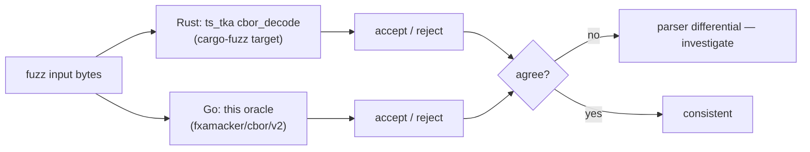

# CBOR differential-fuzzing oracle (TKA decoder)

This directory holds the **Go differential oracle** for fuzzing the pure-Rust Tailnet-Lock (TKA)
CBOR decoder in `ts_tka`.

## Intent

The TKA node-key-signature CBOR decoder
(`ts_tka::Authority::node_key_authorized` → the private `decode_node_key_signature`) parses
**attacker-controlled bytes**: a peer's node-key signature delivered via the control plane. That
makes it the highest-value fuzz target in the crate.

The reference decoder upstream Tailscale uses is Go's
[`github.com/fxamacker/cbor`](https://github.com/fxamacker/cbor). **Differential fuzzing** runs the
same corpus through both decoders and asserts they agree on **accept vs reject** — catching any case
where the Rust decoder is more lenient (a potential parser-differential / smuggling bug) or more
strict than the Go implementation Tailscale trusts on the wire.



There are two halves:

| Half | Location | Role |
| ---- | -------- | ---- |
| Rust | `ts_tka/fuzz/fuzz_targets/cbor_decode.rs` (cargo-fuzz) | Drives `Authority::node_key_authorized` with arbitrary bytes; asserts **panic-free + fail-closed** (always `Err`, never a crash or stack overflow). |
| Go   | `main.go` here | Reads the SAME bytes from stdin, reports whether `fxamacker/cbor` accepts/rejects + the decoded shape. The differential oracle. |

## Running the Rust fuzzer

Requires a **nightly** toolchain and the `cargo-fuzz` tool (`cargo install cargo-fuzz`); the target
links libFuzzer.

```sh
# from the ts_tka/fuzz directory:
cd ts_tka/fuzz
cargo +nightly fuzz run cbor_decode
```

The fuzz crate is its **own** workspace (an empty `[workspace]` table in `ts_tka/fuzz/Cargo.toml`),
per cargo-fuzz convention — it is intentionally not a member of the parent tailscale-rs workspace,
so the nightly/libFuzzer machinery never affects the normal `cargo build`/`cargo test`.

The standalone invariant the Rust target proves on its own: **decoding arbitrary CBOR never panics
and always fails closed** (returns `Err`, respecting the `MAX_SIG_NESTING_DEPTH = 16` nesting bound
in `ts_tka/src/lib.rs` so adversarial nesting cannot overflow the stack).

## Running the Go oracle

This program reads CBOR from stdin and prints a one-line JSON verdict; it shares the parent Go module
(`tests/vectors/gen/go.mod`, module `tsr19kgen`, which already requires `github.com/fxamacker/cbor/v2`).

```sh
# from tests/vectors/gen:
printf '\xa1\x01\x01' | go run ./cbor_diff
# -> {"len":3,"accepted":true,"shape":{...}}

# a truncated byte string is rejected:
printf '\x58\x20' | go run ./cbor_diff
# -> {"len":2,"accepted":false,"error":"..."}
```

Output schema:

```json
{ "len": 3, "accepted": true, "error": "", "shape": { "1": 1 } }
```

`accepted` is the field the differential assertion compares against the Rust verdict; `shape` is
advisory (what Go decoded). The decode posture is set to match the Rust decoder's: definite lengths
only, duplicate map keys rejected, and no trailing bytes after the top-level item.

## Follow-on

Wiring the two halves into an **automated** differential loop — harvest the cargo-fuzz corpus, pipe
each input through this Go oracle, and assert the Rust and Go accept/reject verdicts match (failing
CI on any divergence) — is the follow-on task, tracked as **tsr-19k**. Until then, run each half
manually against a shared corpus.
